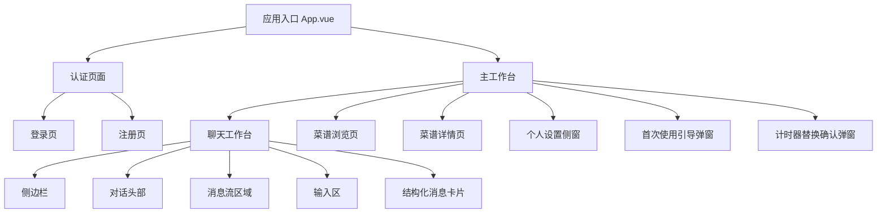
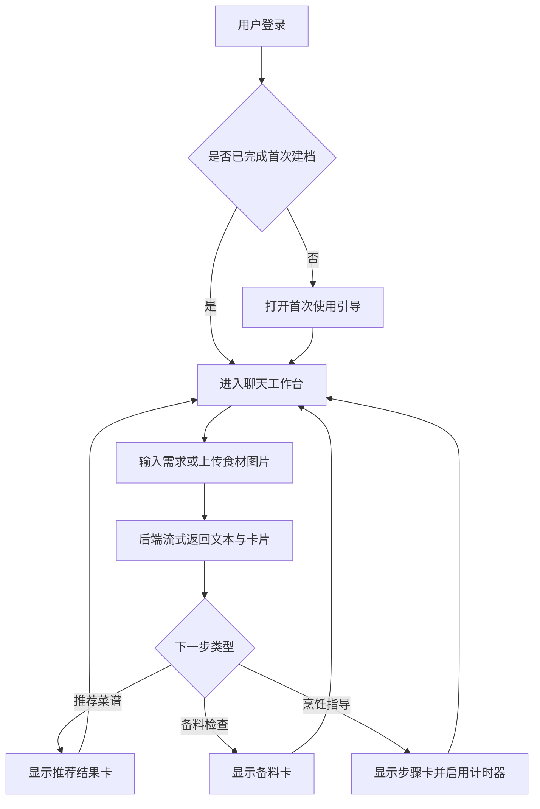

# ChefMate 智能体应用前端详细设计报告

## 1. 项目说明

ChefMate 是一个面向日常家庭烹饪场景的智能体应用。当前版本以前端工作台为主要交互入口，将用户登录、首次建档、对话式推荐、备料检查、烹饪步骤指导、菜谱浏览与个人设置整合在同一套界面体系中。与早期概要设计相比，系统已经从“按功能分散跳转”的思路调整为“以聊天工作台为中心、以卡片驱动任务推进”的实现方式。

前端采用 `Vue 3 + TypeScript + Vite` 实现，后端采用 `FastAPI` 提供认证、会话、菜谱、画像与文件上传接口。本文所述前端实现主要对应 `frontend` 目录中的页面、组件、状态与接口封装模块。

## 2. 应用页面组织结构

### 2.1 页面总体结构

当前前端虽然保留了登录页、聊天页、菜谱页等路由入口，但核心实现采用单一工作台 `App.vue` 统一承载页面切换。系统页面组织结构如下：



### 2.2 路由组织

前端已实现的主要路由如下：

| 路由 | 页面含义 | 当前实现方式 |
| --- | --- | --- |
| `/auth/login` | 登录页 | 由 `App.vue` 渲染 `AuthPage` 登录模式 |
| `/auth/register` | 注册页 | 由 `App.vue` 渲染 `AuthPage` 注册模式 |
| `/chat/:conversationId?` | 对话工作台 | 默认主页面，支持新建对话与恢复历史对话 |
| `/recipes` | 菜谱浏览页 | 展示推荐菜谱与搜索结果 |
| `/recipes/:recipeId` | 菜谱详情页 | 展示单个菜谱详情并可发起对话 |

页面切换的实现不是为每个路由单独挂载完整页面，而是通过 `App.vue` 依据当前路由决定展示认证页、聊天工作台或菜谱页。这种组织方式使对话、计时器、资料设置与弹窗状态可以在同一应用上下文中持续保留。

### 2.3 页面层次说明

1. 认证层：负责用户注册、登录和登录态校验。
2. 工作台层：负责对话、菜谱、计时器与个人资料的统一承载。
3. 叠加层：负责首次建档弹窗、资料设置弹窗、操作确认弹窗等浮层交互。
4. 卡片层：负责在消息流中呈现推荐、备料、菜谱详情与烹饪步骤等结构化内容。

> [截图占位：应用整体页面结构示意图]

## 3. 各页面详细设计

### 3.1 登录与注册页面

### 3.1.1 页面功能

该页面用于完成用户身份认证，并在成功后进入主工作台。

主要功能包括：

- 用户名、邮箱、密码输入
- 登录与注册模式切换
- 表单校验与错误提示
- 登录成功后保存本地会话信息
- 未登录用户访问业务页面时自动重定向到登录页

### 3.1.2 页面原型

页面为双态结构，一套组件支持登录与注册两种模式。页面包含欢迎文案、功能亮点说明、表单输入区和提交按钮。

页面顶部为品牌与欢迎信息区域，用于呈现系统名称、说明文字和当前模式下的引导语。中部为表单输入区，登录模式下包含用户名和密码输入项，注册模式下增加邮箱和确认密码输入项，并在输入项附近显示校验状态与错误提示。底部为主操作区，提供提交按钮以及登录、注册模式切换入口。

### 3.1.3 交互功能

- 输入内容不符合规范时，页面即时显示校验提示。
- 注册页对用户名、密码强度、确认密码一致性进行动态反馈。
- 认证成功后保存 token 与用户基础信息，并跳转到 `/chat`。
- 已登录用户再次访问认证页时，会自动进入聊天工作台。

> [截图占位：登录页界面]
> [截图占位：注册页界面]

### 3.2 首次使用引导页面

### 3.2.1 页面功能

首次进入系统时，页面以弹窗方式引导用户完成基础建档，为后续菜谱推荐和对话记忆提供个性化信息。

主要功能包括：

- 设置账户显示名称
- 选择长期记忆标签
- 填写做饭偏好文本
- 设置“是否允许自动更新偏好档案”
- 设置“是否自动启动步骤计时器”
- 完成建档后自动进入新对话

### 3.2.2 页面原型

页面采用多步骤向导形式，左侧显示流程进度，右侧显示当前步骤内容。

页面左侧为步骤导航区，按顺序列出欢迎、完善信息、偏好档案、记忆设置和开始对话等流程节点。右侧为步骤内容区，依次展示昵称填写、标签选择、偏好描述填写、功能开关设置等内容。底部设置上一步、下一步、跳过和完成等操作按钮，用于控制向导流程推进。

### 3.2.3 交互功能

- 用户可逐步前进、后退，也可跳过偏好设置步骤。
- 第二步要求昵称长度满足条件后才能继续。
- 完成后将资料写回用户画像接口，并将 `complete_workspace_onboarding` 标记为完成。

> [截图占位：首次使用引导弹窗]

### 3.3 聊天工作台页面

### 3.3.1 页面功能

聊天工作台是系统核心页面，用于承接“需求表达、菜品推荐、备料检查、步骤指导”的完整流程。

主要功能包括：

- 展示历史会话列表
- 创建新对话与切换对话
- 展示会话标题、阶段、当前菜品与计时器状态
- 支持文本输入、快捷建议输入、图片上传输入
- 接收智能体流式响应
- 在消息区展示结构化卡片
- 管理本地计时器并在倒计时结束后自动聚焦对应会话

### 3.3.2 页面原型

页面由左侧边栏和右侧主区域组成。

页面左侧为导航边栏，包含新建对话入口、菜谱快捷入口、历史会话列表和个人资料入口。右侧为主内容区，上部是对话头部，用于显示当前会话标题、任务阶段、菜品名称及计时器状态；中部为消息流区域，用于展示欢迎内容、历史消息与结构化卡片；底部为输入区，包含快捷建议词、图片上传按钮、文本输入框与发送按钮。

### 3.3.3 交互功能

- 新建对话后进入草稿会话状态，显示问候语和建议词。
- 发送文本或图片时，如当前无正式会话，系统先创建会话再发送消息。
- 智能体回复采用流式展示，界面会先插入临时助手消息，再逐步更新文字内容。
- 对话每次返回新 `suggestions` 时，输入区快捷建议同步更新。
- 同一会话中相同类型的卡片只保留最新实例，避免旧状态残留。
- 切换会话时，对应计时器继续运行；若其他会话存在进行中的计时器，侧边栏会显示“正在倒计时”。

> [截图占位：聊天工作台总览]
> [截图占位：聊天页面中的流式回复效果]

### 3.4 推荐结果卡页面单元

### 3.4.1 页面功能

推荐结果卡作为聊天工作台中的结构化单元，用于展示智能体根据用户需求给出的候选菜谱。

主要功能包括：

- 展示推荐标题与候选数量
- 展示菜名、简介、时长、难度、份量、标签
- 支持“查看详情”和“想尝试”等动作按钮

### 3.4.2 页面原型

推荐结果卡顶部为卡片标题区，显示推荐标题与候选菜谱数量。中部采用卡片网格或列表形式呈现候选菜谱，每个条目包含菜名、简介、预计时长、难度、份量和标签信息。底部为动作区，提供查看详情和尝试该菜等操作按钮。

### 3.4.3 交互功能

- 点击“查看详情”触发结构化动作，进入菜谱详情查看。
- 点击“想尝试”触发结构化动作，推动对话进入下一阶段。
- 推荐卡位于消息流中，能够随着新消息更新替换旧版本。

> [截图占位：推荐结果卡]

### 3.5 备料检查卡页面单元

### 3.5.1 页面功能

备料检查卡用于展示目标菜谱所需食材的准备情况，支持列表与闪卡两种查看模式。

主要功能包括：

- 展示食材清单、用量、备注和准备状态
- 计算当前完成度百分比
- 支持逐项勾选已备齐食材
- 支持用户点击“这些都备齐了”继续任务

### 3.5.2 页面原型

备料检查卡顶部显示标题和当前完成度，并通过进度条呈现备料进展。中部设置“列表模式”和“闪卡模式”切换区域。内容区逐项展示食材名称、用量、备注和当前状态，用户可以在此勾选或切换备料状态。底部为主操作按钮，用于确认食材已经备齐并继续后续流程。

### 3.5.3 交互功能

- 用户可以直接勾选食材状态，界面进度条实时变化。
- 在闪卡模式下可逐条切换食材并标记状态。
- 底部主按钮会向后端发送结构化动作 `ingredients_ready`，用于驱动对话进入烹饪阶段。

> [截图占位：备料检查卡]

### 3.6 烹饪步骤卡页面单元

### 3.6.1 页面功能

烹饪步骤卡用于展示结构化步骤指导，是聊天页中的核心执行界面。

主要功能包括：

- 展示当前步骤进度
- 支持“列表模式”和“闪卡模式”切换
- 支持上一步、下一步浏览
- 对带计时字段的步骤触发前端倒计时

### 3.6.2 页面原型

烹饪步骤卡顶部显示菜谱名称、当前步骤编号和总步骤数。中部设置列表模式与闪卡模式切换按钮。内容区展示当前步骤标题、操作说明、预计时长和注意事项；当步骤含有计时信息时，同一区域显示启动计时入口。底部为步骤导航区，提供上一步和下一步操作。

### 3.6.3 交互功能

- 用户可直接点击步骤列表切换当前焦点步骤。
- 当步骤带有 `timerSeconds` 字段时，可手动启动计时器。
- 若个人设置中开启自动计时，则进入带时长步骤时自动触发计时请求。
- 当计时结束时，界面会弹出提醒，并自动切换到对应对话、聚焦烹饪步骤卡。

> [截图占位：烹饪步骤卡]
> [截图占位：计时器运行状态]

### 3.7 菜谱浏览页面

### 3.7.1 页面功能

菜谱浏览页提供独立于对话之外的手动浏览入口，便于用户按关键词或偏好检索菜谱。

主要功能包括：

- 展示系统推荐菜谱
- 展示最近浏览或最近尝试的菜谱
- 提供关键词搜索
- 提供多字段联合搜索
- 点击菜谱后进入详情页

### 3.7.2 页面原型

菜谱浏览页顶部为检索区，包含关键词输入框、搜索字段选择项以及搜索与恢复推荐按钮。中部优先显示最近浏览或最近尝试过的菜谱区域，方便用户快速回到近期记录。下方为推荐菜谱或搜索结果区域，以卡片网格方式展示菜谱条目，每个条目包含菜名、简介、标签和基础属性。

### 3.7.3 交互功能

- 未搜索时默认展示推荐菜谱与最近记录。
- 搜索时可按菜名、食材、做法、口味等字段组合检索。
- 搜索失败时显示空状态提示。
- 从菜谱浏览页点击菜谱后，切换到菜谱详情页。

> [截图占位：菜谱浏览页]

### 3.8 菜谱详情页面

### 3.8.1 页面功能

菜谱详情页用于展示单道菜的完整信息，并支持从菜谱直接发起新对话。

主要功能包括：

- 展示菜名、描述、标签、难度、预计时长、份量
- 展示食材明细
- 展示步骤明细
- 展示提示说明
- 支持“开始这道菜”或“发起对话”类操作

### 3.8.2 页面原型

菜谱详情页顶部为返回与标题区，显示返回列表入口、菜谱名称以及菜谱简介。其下为基础属性区，用于展示标签、难度、预计时长和份量等信息。页面中部依次设置食材列表区和步骤列表区，完整呈现菜谱制作信息。底部为操作区，提供围绕当前菜谱发起对话或开始烹饪任务的入口。

### 3.8.3 交互功能

- 点击返回按钮回到菜谱浏览页。
- 点击开始按钮后，前端调用创建会话接口，以当前菜谱作为对话来源创建新会话。
- 创建成功后自动跳转到聊天工作台，并进入该会话的上下文中。

> [截图占位：菜谱详情页]

### 3.9 个人设置页面

### 3.9.1 页面功能

个人设置页以覆盖侧窗方式打开，用于维护用户资料、长期记忆标签、系统设置与账户信息。

主要功能包括：

- 编辑显示名称与邮箱
- 编辑偏好描述
- 选择长期记忆标签
- 控制自动更新偏好开关
- 控制自动启动步骤计时器开关
- 退出登录

### 3.9.2 页面原型

个人设置页采用标签页结构组织内容，顶部为页面标题与页签导航，包含档案、设置、账户和关于等分区。档案页主要包含长期记忆标签和偏好描述文本；设置页主要包含自动更新偏好与自动启动计时器等系统开关；账户页用于展示和编辑账户相关信息。页面底部设置保存与退出登录等操作入口。

### 3.9.3 交互功能

- 标签支持已选与可选两区切换。
- 页面打开时自动从后端刷新用户画像与标签目录。
- 保存时仅提交界面所需最小字段，降低状态冗余。
- 退出登录后会清空本地会话状态并返回登录页。

> [截图占位：个人设置页]

## 4. 页面交互流程设计

### 4.1 核心用户流程



### 4.2 典型交互特点

- 对话是主入口，菜谱浏览是补充入口。
- 页面状态与对话状态一一对应，通过 `stage` 字段体现当前处于闲聊、推荐、备料或烹饪阶段。
- 输入区支持文本与图片联合发送，适配“看图识别食材”的场景。
- 界面不是简单聊天记录堆叠，而是由消息卡片承担任务阶段可视化表达。

## 5. 前端实现设计

### 5.1 前端代码组织

当前前端主要目录结构如下：

```text
frontend/src
├── App.vue                         应用主工作台与页面切换
├── router/index.ts                路由与登录守卫
├── lib/api.ts                     前后端接口封装与数据规范化
├── state/auth.ts                  登录态缓存
├── types/chat.ts                  会话、卡片、菜谱等核心类型
├── components/
│   ├── AuthPage.vue               登录注册页
│   ├── AppSidebar.vue             侧边栏
│   ├── ChatHeader.vue             对话头部与计时器区
│   ├── ComposerPanel.vue          输入区与图片上传
│   ├── MessageBubble.vue          消息气泡
│   ├── RecipeLibraryPanel.vue     菜谱浏览与详情
│   ├── ProfileSettingsPanel.vue   个人设置页
│   ├── WorkspaceOnboardingModal.vue 首次建档弹窗
│   └── cards/                     结构化消息卡片
└── styles.css                     全局样式
```

### 5.2 核心数据结构

前端围绕“会话、消息、卡片、菜谱、用户画像”五类对象组织状态，其中会话结构如下：

```ts
interface ConversationRecord {
  id: string
  title: string
  stage: 'idea' | 'planning' | 'shopping' | 'cooking'
  currentRecipe?: string
  suggestions: string[]
  messages: ChatMessage[]
}
```

该设计能够直接支撑：

- 侧边栏会话列表
- 顶部阶段状态展示
- 快捷建议词更新
- 消息流内容渲染

### 5.3 接口对接设计

前端通过 `/api` 统一访问后端服务，当前已打通的接口包括：

| 接口模块 | 主要接口 | 用途 |
| --- | --- | --- |
| 认证 | `/auth/login` `/auth/register` `/auth/logout` | 登录注册与退出 |
| 用户画像 | `/profile` `/profile/tag-catalog` | 读取与更新用户资料、标签目录 |
| 会话 | `/conversations` `/conversations/{id}` | 获取会话列表与会话详情 |
| 消息 | `/conversations/{id}/messages/stream` | 流式发送消息并接收智能体响应 |
| 菜谱 | `/recipes` `/recipes/{id}` | 获取菜谱列表与详情 |
| 文件 | `/files/images` | 上传食材图片 |


### 5.4 卡片渲染实现

系统将结构化输出拆分为推荐卡、菜谱详情卡、备料卡、步骤卡四类，由统一渲染器按类型分发：

```vue
<RecipeRecommendationsCard v-if="props.card.type === 'recipe-recommendations'" />
<RecipeDetailCard v-else-if="props.card.type === 'recipe-detail'" />
<PantryStatusCard v-else-if="props.card.type === 'pantry-status'" />
<CookingGuideCard v-else />
```

为了保证界面状态清晰，系统在同一会话中只保留每类卡片的最新实例。这样当推荐结果、备料状态或步骤状态更新时，用户看到的是当前有效状态，而不是历史状态的简单堆叠。

### 5.5 计时器实现

计时器采用纯前端本地状态管理，每个会话维护一个当前计时器槽位，包含步骤编号、总时长、剩余时间和状态。其设计特点如下：

- 切换会话时计时器继续运行；
- 若非当前会话有进行中的计时器，侧边栏会显示额外提示；
- 计时结束后自动切换到对应会话；
- 计时器不依赖后端广播，降低实现复杂度。

## 6. 小结

当前版本的 ChefMate 前端已完成从认证、首次建档、对话工作台、菜谱浏览、资料设置到消息卡片交互的完整页面实现，能够较好支撑智能体应用在“推荐菜品、检查备料、指导烹饪”场景下的使用需求。相较于早期概要设计，现阶段系统更加突出“聊天工作台中心化、结构化卡片推进任务、多状态统一管理”的实现思路，也更符合智能体应用的实际交互特点。
