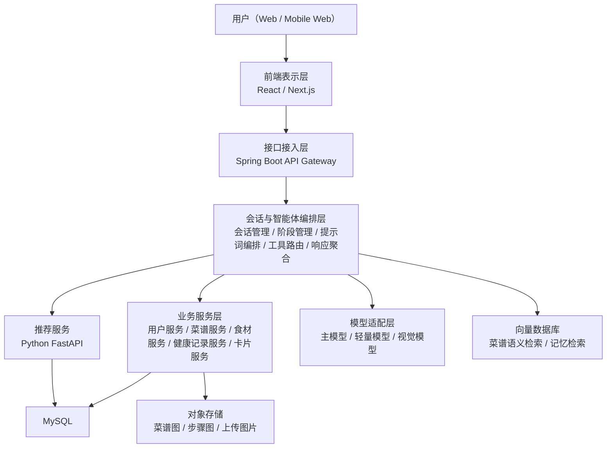
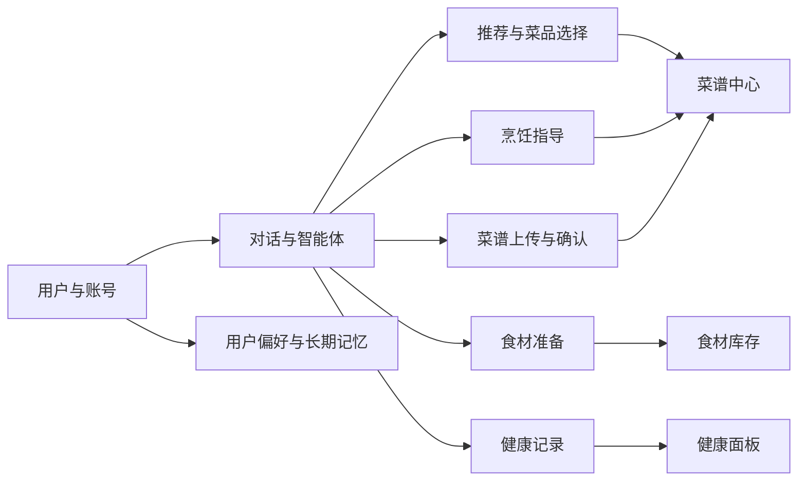
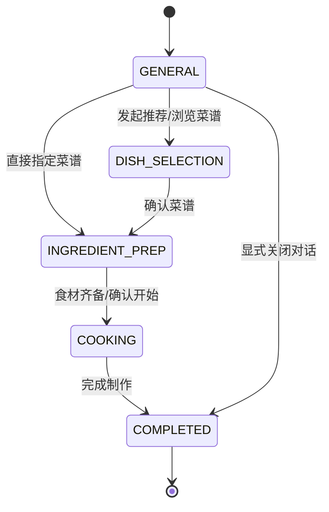

# ChefMate 概要设计

## 1. 文档说明

本文档基于 [detail_requirements.md](/mnt/d/ChefMate/docs/detail_requirements.md) 为主、结合 [project_overview.md](/mnt/d/ChefMate/docs/project_overview.md) 与 [requirements.md](/mnt/d/ChefMate/docs/requirements.md) 补充形成，用于指导 ChefMate 在需求阶段之后进入系统设计、数据建模与接口开发。

设计目标如下：

- 明确系统总体架构与技术分层
- 明确核心业务模块及其职责边界
- 明确分阶段智能体与单活动卡片机制
- 明确核心数据结构、数据库设计、文件存储方案
- 明确前后端接口与内部服务接口的基础约定

## 2. 设计原则

- 对话驱动：用户主要通过类似 ChatGPT 的对话方式发起需求与推进做饭流程
- 阶段驱动：智能体按阶段加载不同提示词、工具集合与卡片类型
- 单活动卡片：单个对话同一时刻仅展示一张活动卡片，新卡片覆盖旧卡片
- 结构化优先：推荐结果、食材检查、烹饪流程、菜谱草稿等均采用结构化数据承载
- 服务解耦：大模型编排、业务服务、推荐服务、存储服务职责拆分
- 可扩展：支持后续增加更多工具、更多模型、更多标签与更多健康能力

## 3. 系统总体架构

ChefMate 采用“前端表示层 -> 接口接入层 -> 会话与智能体编排层 -> 业务服务层 -> 数据与基础设施层”的分层架构。



### 3.1 分层职责

#### 前端表示层

- 提供响应式聊天界面、菜谱列表页、收藏页、健康面板、个人设置页
- 呈现消息流与当前活动卡片
- 承担图片上传、卡片交互、流式响应渲染

#### 接口接入层

- 对外暴露统一 REST / SSE 接口
- 处理鉴权、参数校验、限流、审计日志
- 将前端请求分发到业务服务或智能体编排层

#### 会话与智能体编排层

- 管理会话上下文、阶段状态、标题生成、上下文压缩
- 为不同阶段装配不同系统提示词与工具白名单
- 接收大模型工具调用结果并聚合为前端可消费的消息和卡片
- 保证“单活动卡片”约束

#### 业务服务层

- 用户资料与偏好管理
- 菜谱管理、收藏、上传审核、草稿确认
- 食材库存管理
- 饮食记录与健康统计
- 卡片状态持久化

#### 数据与基础设施层

- MySQL 存储结构化业务数据
- 对象存储保存图片、步骤图、用户上传附件
- 向量数据库保存菜谱语义向量与长期记忆向量

## 4. 技术架构

### 4.1 技术选型建议

| 层级 | 技术选型 | 说明 |
| --- | --- | --- |
| 前端 | React + Next.js + TypeScript | 适合实现聊天页、列表页、卡片组件与移动端适配 |
| 后端主服务 | Spring Boot | 承担统一 API、会话管理、状态机、业务编排 |
| 推荐服务 | Python + FastAPI | 负责推荐算法训练、在线召回、排序与推荐解释特征输出 |
| 数据库 | MySQL 8.x | 存储用户、会话、菜谱、食材、健康记录等结构化数据 |
| 向量数据库 | Milvus / pgvector / Weaviate | 用于菜谱语义检索与长期记忆检索 |
| 对象存储 | MinIO / S3 兼容存储 | 存储菜谱图片、步骤图、上传图片 |
| 模型接入 | 统一模型网关适配层 | 屏蔽不同大模型厂商 API 差异 |
| 实时输出 | SSE | 支持对话流式输出与卡片增量更新 |
| 缓存（可选） | Redis | 可用于会话热点缓存、分布式锁、SSE 临时态 |

### 4.2 模型架构

系统至少对接两类大模型：

- 主模型：高质量模型，用于对话理解、工具调用、阶段推进、卡片更新、复杂回答
- 轻量模型：低成本模型，用于对话摘要压缩、标题生成、简单结构化归纳

可选扩展：

- 视觉模型：用于识别上传菜谱图片、食材图片、新鲜度辅助识别

### 4.3 部署架构

- 前端独立部署
- Spring Boot 主服务独立部署
- 推荐服务独立部署
- MySQL、对象存储、向量数据库独立部署
- 模型服务通过外部 API 或内网网关接入

推荐采用以下环境划分：

- `dev`：本地联调与原型验证
- `test`：集成测试与提示词/工具联调
- `prod`：正式环境

## 5. 功能架构



### 5.1 一级功能模块

- 用户与账号模块
- 对话与智能体模块
- 菜谱中心模块
- 推荐模块
- 食材管理模块
- 烹饪指导模块
- 健康记录模块
- 文件与媒体模块
- 运营与后台配置模块

### 5.2 模块说明

#### 5.2.1 用户与账号模块

功能范围：

- 注册、登录、鉴权
- 基础资料维护
- 首次问卷填写与后续修改
- 偏好、忌口、过敏、健康目标、厨具、做饭熟练度、耗时偏好管理

#### 5.2.2 对话与智能体模块

功能范围：

- 新建对话、消息收发、会话列表
- 会话标题生成与上下文压缩
- 阶段状态管理
- 工具白名单装配
- 活动卡片创建、替换、更新、归档

#### 5.2.3 菜谱中心模块

功能范围：

- 菜谱浏览、搜索、筛选、收藏
- 菜谱详情展示
- 菜谱结构化步骤管理
- 用户上传菜谱草稿识别与确认

#### 5.2.4 推荐模块

功能范围：

- 基于用户偏好、健康目标、已有食材、厨具、耗时要求进行推荐
- 提供首页菜谱推荐与对话内推荐
- 输出候选菜谱及推荐解释特征

#### 5.2.5 食材管理模块

功能范围：

- 家庭食材库存增删改查
- 位置、数量、单位、保质期管理
- 菜谱所需食材与家庭库存比对
- 生成缺失食材清单

#### 5.2.6 烹饪指导模块

功能范围：

- 生成步骤式烹饪卡片
- 展示步骤、配图、时间提示、注意事项
- 基于当前步骤持续回答用户问题

#### 5.2.7 健康记录模块

功能范围：

- 在“完成做菜”后记录饮食数据
- 展示每日、累计营养摄入与做饭历史
- 采集用户评分与饱腹感反馈

## 6. 核心业务流程设计

### 6.1 智能体阶段状态机

系统定义如下阶段：

- `GENERAL`：普通对话阶段
- `DISH_SELECTION`：菜品选择阶段
- `INGREDIENT_PREP`：食材准备阶段
- `COOKING`：厨房烹饪阶段
- `COMPLETED`：已完成阶段

阶段说明：

- 普通对话阶段可处理普通问答、上传菜谱、食材管理、发起推荐
- 菜品选择阶段主要展示推荐菜谱卡片与确认目标菜谱
- 食材准备阶段展示需要/缺少的食材及勾选状态
- 厨房烹饪阶段展示烹饪流程卡片与步骤推进
- 已完成阶段表示本次对话流程结束，不允许继续推进核心流程



### 6.2 单活动卡片机制

规则如下：

- 一个对话同一时刻最多只有一张活动卡片
- 创建新卡片时，旧卡片转为历史卡片或被覆盖
- 卡片修改工具仅允许更新当前活动卡片
- 前端只渲染当前活动卡片，历史卡片通过会话回放查看

支持的卡片类型：

- 菜品选择卡片
- 食材准备卡片
- 烹饪流程卡片
- 菜谱展示/确认卡片

### 6.3 上传菜谱流程

1. 用户在普通对话中上传图片或文本
2. 智能体调用“创建菜谱工具”
3. 系统通过视觉模型/文本抽取生成菜谱草稿
4. 创建“菜谱展示卡片”供用户确认与修改
5. 用户确认后提交到菜谱中心，绑定上传者 `user_id`

### 6.4 完成做菜后的健康闭环

1. 用户在烹饪阶段确认完成
2. 智能体调用“创建饮食记录工具”
3. 系统写入饮食记录与营养估算
4. 健康面板展示今日与累计统计
5. 用户可补充口味评分与饱腹感评分

## 7. 功能模块详细设计

### 7.1 会话与消息模块

核心职责：

- 保存消息上下文
- 生成会话标题
- 维护当前阶段、当前菜谱、当前活动卡片
- 在消息过长时触发上下文压缩

关键约束：

- 对话输入支持文本、图片
- 对话输出支持文本、卡片、工具执行结果摘要
- 需要记录每次模型调用、工具调用与错误信息

### 7.2 提示词与工具编排模块

设计要点：

- 每个阶段维护独立的系统提示词模板
- 每个阶段绑定允许调用的工具集合
- 提示词中注入用户画像摘要、当前菜谱摘要、当前卡片摘要、历史摘要

推荐工具集：

- 阶段管理工具
- 卡片修改工具
- 菜谱推荐展示工具
- 食材准备展示工具
- 烹饪流程展示工具
- 创建菜谱工具
- 食材管理工具组
- 饮食记录创建工具

### 7.3 推荐模块

输入：

- 用户画像
- 问卷偏好
- 长期记忆偏好
- 当前库存食材
- 当前可用厨具
- 做饭时间预算
- 健康目标

输出：

- 候选菜谱列表
- 推荐分数
- 推荐理由特征
- 缺失食材摘要

推荐服务分层：

- 召回：基于标签、食材、场景、健康目标快速召回候选
- 排序：综合偏好匹配、库存匹配、时间成本、营养匹配进行打分
- 解释：返回可被大模型使用的解释标签

### 7.4 菜谱模块

能力范围：

- 系统菜谱与用户上传菜谱统一存储
- 菜谱支持图片、步骤图、标签、营养信息、结构化步骤 JSON
- 支持收藏、搜索、筛选、查看详情

### 7.5 食材模块

能力范围：

- 记录名称、数量、单位、位置、状态、保质期
- 支持按用户维度存储家中库存
- 支持将库存与菜谱食材要求进行差异计算

### 7.6 健康模块

能力范围：

- 记录每次做菜后的饮食摄入
- 提供日维度、周维度、累计维度统计
- 关联用户反馈，用于长期偏好学习

## 8. 数据结构设计

### 8.1 核心领域对象

#### 用户画像 `UserProfile`

```json
{
  "userId": 1001,
  "nickname": "Lan",
  "spicyLevel": 2,
  "tastePreferences": ["鲜", "微辣"],
  "dislikes": ["香菜"],
  "allergies": ["花生"],
  "healthGoals": ["减脂", "控糖"],
  "availableCookware": ["炒锅", "空气炸锅"],
  "cookingSkillLevel": "BEGINNER",
  "preferredCookTimeMinutes": 30,
  "bio": "工作日晚饭想尽量快一些"
}
```

#### 长期记忆 `UserLongTermMemory`

```json
{
  "userId": 1001,
  "learnedCuisinePrefs": ["川菜", "家常菜"],
  "costSensitivity": "MEDIUM",
  "favoriteScenes": ["一人食", "夜宵"],
  "ingredientPreferences": ["鸡胸肉", "番茄"],
  "memorySummary": "偏好低油、30分钟内完成的酸辣家常菜"
}
```

#### 菜谱 `Recipe`

```json
{
  "recipeId": 501,
  "name": "番茄鸡蛋面",
  "sourceType": "SYSTEM",
  "ownerUserId": null,
  "coverImageUrl": "recipes/501/cover.jpg",
  "difficulty": "EASY",
  "cookTimeMinutes": 15,
  "costLevel": "LOW",
  "servings": 1,
  "tags": {
    "flavor": ["鲜", "微酸"],
    "method": ["煮"],
    "health": ["清淡"],
    "scene": ["一人食"],
    "tool": ["汤锅"]
  }
}
```

#### 对话活动卡片 `ActiveCard`

```json
{
  "conversationId": 9001,
  "cardId": 30001,
  "cardType": "INGREDIENT_PREP",
  "version": 4,
  "payload": {},
  "status": "ACTIVE"
}
```

### 8.2 卡片结构设计

#### 菜品选择卡片 `DishSelectionCard`

```json
{
  "type": "DISH_SELECTION",
  "title": "今晚可以试试这几道",
  "items": [
    {
      "recipeId": 501,
      "name": "番茄鸡蛋面",
      "reason": "15分钟内完成，适合一人食",
      "matchScore": 0.92,
      "missingIngredientCount": 1
    }
  ],
  "actions": ["refresh", "select"]
}
```

#### 食材准备卡片 `IngredientPrepCard`

```json
{
  "type": "INGREDIENT_PREP",
  "recipeId": 501,
  "summary": {
    "requiredCount": 6,
    "ownedCount": 4,
    "missingCount": 2
  },
  "items": [
    {
      "ingredientName": "番茄",
      "requiredAmount": "2个",
      "status": "OWNED",
      "checked": true
    },
    {
      "ingredientName": "挂面",
      "requiredAmount": "100g",
      "status": "MISSING",
      "checked": false
    }
  ]
}
```

#### 烹饪流程卡片 `CookingFlowCard`

```json
{
  "type": "COOKING",
  "recipeId": 501,
  "currentStep": 2,
  "totalSteps": 5,
  "steps": [
    {
      "stepNo": 1,
      "title": "准备食材",
      "instruction": "番茄切块，鸡蛋打散",
      "durationSeconds": 180,
      "imageUrl": "recipes/501/steps/1.jpg"
    }
  ]
}
```

#### 菜谱展示卡片 `RecipeDraftCard`

```json
{
  "type": "RECIPE_DRAFT",
  "draftId": "draft_20260309_001",
  "name": "蒜香鸡胸肉",
  "ingredients": [],
  "steps": [],
  "status": "PENDING_CONFIRM"
}
```

## 9. 数据库设计

数据库建议采用 MySQL，核心表如下。

### 9.1 用户与偏好相关表

#### `user_account`

| 字段 | 类型 | 说明 |
| --- | --- | --- |
| id | bigint PK | 用户 ID |
| email | varchar(128) | 登录邮箱 |
| password_hash | varchar(255) | 密码摘要 |
| nickname | varchar(64) | 昵称 |
| avatar_url | varchar(255) | 头像 |
| status | varchar(32) | 状态 |
| created_at | datetime | 创建时间 |
| updated_at | datetime | 更新时间 |

#### `user_preference_profile`

| 字段 | 类型 | 说明 |
| --- | --- | --- |
| user_id | bigint PK | 用户 ID |
| spicy_level | tinyint | 吃辣程度 |
| cooking_skill_level | varchar(32) | 熟练度 |
| preferred_cook_time_minutes | int | 可接受时长 |
| bio | varchar(100) | 100 字内描述 |
| taste_pref_json | json | 口味偏好 |
| dislikes_json | json | 忌口 |
| allergies_json | json | 过敏 |
| health_goals_json | json | 健康目标 |
| cookware_json | json | 常用厨具 |
| updated_at | datetime | 更新时间 |

#### `user_long_term_memory`

| 字段 | 类型 | 说明 |
| --- | --- | --- |
| id | bigint PK | 主键 |
| user_id | bigint | 用户 ID |
| memory_type | varchar(32) | 记忆类型 |
| memory_summary | text | 记忆摘要 |
| source_ref | varchar(128) | 来源记录 |
| embedding_id | varchar(128) | 向量 ID |
| confidence | decimal(5,4) | 置信度 |
| created_at | datetime | 创建时间 |

### 9.2 会话与智能体相关表

#### `conversation`

| 字段 | 类型 | 说明 |
| --- | --- | --- |
| id | bigint PK | 会话 ID |
| user_id | bigint | 用户 ID |
| title | varchar(128) | 会话标题 |
| stage | varchar(32) | 当前阶段 |
| current_recipe_id | bigint | 当前关联菜谱 |
| active_card_id | bigint | 当前活动卡片 ID |
| summary_text | text | 压缩后的对话摘要 |
| status | varchar(32) | OPEN / CLOSED |
| created_at | datetime | 创建时间 |
| updated_at | datetime | 更新时间 |

#### `conversation_message`

| 字段 | 类型 | 说明 |
| --- | --- | --- |
| id | bigint PK | 消息 ID |
| conversation_id | bigint | 会话 ID |
| role | varchar(16) | user / assistant / tool / system |
| content_type | varchar(16) | text / image / json |
| content_text | longtext | 文本内容 |
| attachment_json | json | 图片或附件 |
| model_name | varchar(64) | 使用模型 |
| token_usage_json | json | token 统计 |
| created_at | datetime | 创建时间 |

#### `agent_tool_call_log`

| 字段 | 类型 | 说明 |
| --- | --- | --- |
| id | bigint PK | 主键 |
| conversation_id | bigint | 会话 ID |
| message_id | bigint | 关联消息 ID |
| stage | varchar(32) | 调用发生阶段 |
| tool_name | varchar(64) | 工具名 |
| request_json | json | 请求参数 |
| response_json | json | 返回结果 |
| status | varchar(32) | SUCCESS / FAIL |
| created_at | datetime | 创建时间 |

#### `conversation_card`

| 字段 | 类型 | 说明 |
| --- | --- | --- |
| id | bigint PK | 卡片 ID |
| conversation_id | bigint | 会话 ID |
| card_type | varchar(32) | 卡片类型 |
| version | int | 版本号 |
| payload_json | json | 卡片结构数据 |
| is_active | tinyint | 是否当前活动卡片 |
| created_at | datetime | 创建时间 |
| updated_at | datetime | 更新时间 |

建议约束：

- 每个 `conversation_id` 只允许一条 `is_active = 1`

### 9.3 菜谱相关表

#### `recipe`

| 字段 | 类型 | 说明 |
| --- | --- | --- |
| id | bigint PK | 菜谱 ID |
| source_type | varchar(16) | SYSTEM / USER |
| owner_user_id | bigint | 上传用户 |
| name | varchar(128) | 菜谱名 |
| description | text | 简介 |
| cover_image_url | varchar(255) | 封面 |
| difficulty | varchar(16) | 难度 |
| cook_time_minutes | int | 时长 |
| cost_level | varchar(16) | 成本 |
| servings | int | 份量 |
| calories | decimal(10,2) | 热量 |
| protein_g | decimal(10,2) | 蛋白质 |
| fat_g | decimal(10,2) | 脂肪 |
| carbs_g | decimal(10,2) | 碳水 |
| sodium_mg | decimal(10,2) | 钠 |
| fiber_g | decimal(10,2) | 纤维 |
| recipe_steps_json | json | 烹饪流程结构化 JSON |
| status | varchar(16) | DRAFT / PUBLISHED |
| created_at | datetime | 创建时间 |
| updated_at | datetime | 更新时间 |

#### `recipe_ingredient`

| 字段 | 类型 | 说明 |
| --- | --- | --- |
| id | bigint PK | 主键 |
| recipe_id | bigint | 菜谱 ID |
| ingredient_name | varchar(64) | 食材名 |
| amount | decimal(10,2) | 数量 |
| unit | varchar(32) | 单位 |
| is_optional | tinyint | 是否可选 |
| substitute_json | json | 替代项 |
| sort_order | int | 排序 |

#### `recipe_tag_dictionary`

| 字段 | 类型 | 说明 |
| --- | --- | --- |
| id | bigint PK | 主键 |
| category | varchar(32) | 标签分类 |
| bit_position | int | 固定比特位 |
| tag_code | varchar(64) | 标签编码 |
| tag_name | varchar(64) | 标签名称 |
| is_enabled | tinyint | 是否启用 |

#### `recipe_feature_bitmap`

| 字段 | 类型 | 说明 |
| --- | --- | --- |
| recipe_id | bigint PK | 菜谱 ID |
| flavor_bits | varbinary(64) | 口味标签位图 |
| method_bits | varbinary(64) | 烹饪方式位图 |
| health_bits | varbinary(64) | 健康标签位图 |
| ingredient_bits | varbinary(128) | 食材标签位图 |
| scene_bits | varbinary(32) | 场景标签位图 |
| difficulty_bits | varbinary(16) | 难度标签位图 |
| time_bits | varbinary(16) | 时间标签位图 |
| cost_bits | varbinary(16) | 成本标签位图 |
| tool_bits | varbinary(32) | 厨具标签位图 |
| taboo_bits | varbinary(64) | 忌口/过敏标签位图 |

说明：

- 该表满足“固定标签 + 0/1 特征存储”的需求
- 标签位定义由 `recipe_tag_dictionary` 统一维护，保证训练与在线一致

#### `user_recipe_favorite`

| 字段 | 类型 | 说明 |
| --- | --- | --- |
| id | bigint PK | 主键 |
| user_id | bigint | 用户 ID |
| recipe_id | bigint | 菜谱 ID |
| created_at | datetime | 创建时间 |

### 9.4 食材相关表

#### `user_ingredient_inventory`

| 字段 | 类型 | 说明 |
| --- | --- | --- |
| id | bigint PK | 主键 |
| user_id | bigint | 用户 ID |
| ingredient_name | varchar(64) | 食材名称 |
| amount | decimal(10,2) | 数量 |
| unit | varchar(32) | 单位 |
| storage_location | varchar(64) | 位置 |
| freshness_status | varchar(32) | 新鲜状态 |
| expires_at | datetime | 过期时间 |
| note | varchar(255) | 备注 |
| created_at | datetime | 创建时间 |
| updated_at | datetime | 更新时间 |

### 9.5 健康记录相关表

#### `diet_record`

| 字段 | 类型 | 说明 |
| --- | --- | --- |
| id | bigint PK | 主键 |
| user_id | bigint | 用户 ID |
| recipe_id | bigint | 菜谱 ID |
| conversation_id | bigint | 来源会话 |
| meal_type | varchar(16) | 早餐/午餐/晚餐/加餐/夜宵 |
| record_time | datetime | 记录时间 |
| calories | decimal(10,2) | 热量 |
| protein_g | decimal(10,2) | 蛋白质 |
| fat_g | decimal(10,2) | 脂肪 |
| carbs_g | decimal(10,2) | 碳水 |
| sugar_g | decimal(10,2) | 糖 |
| sodium_mg | decimal(10,2) | 钠 |
| fiber_g | decimal(10,2) | 膳食纤维 |
| user_rating | varchar(16) | 爱吃/一般/不喜欢 |
| satiety_rating | tinyint | 饱腹感评分 |
| created_at | datetime | 创建时间 |

### 9.6 核心索引与约束建议

- `conversation(user_id, updated_at desc)`：用于会话列表
- `conversation_message(conversation_id, created_at)`：用于消息回放
- `conversation_card(conversation_id, is_active)`：用于快速定位活动卡片
- `user_recipe_favorite(user_id, recipe_id)` 唯一约束：避免重复收藏
- `user_ingredient_inventory(user_id, ingredient_name)`：用于库存检索与去重
- `diet_record(user_id, record_time)`：用于健康面板按时间聚合
- `recipe(name)`、`recipe(status, created_at)`：用于菜谱搜索和列表展示

## 10. 文件与对象存储设计

建议采用对象存储保存媒体文件，路径约定如下：

```text
/recipes/{recipeId}/cover.jpg
/recipes/{recipeId}/steps/{stepNo}.jpg
/user-uploads/{userId}/recipe-drafts/{draftId}/source-1.jpg
/user-uploads/{userId}/ingredients/{uploadId}.jpg
/conversation/{conversationId}/attachments/{fileId}.jpg
```

文件类型包括：

- 菜谱封面图
- 菜谱步骤图
- 用户上传菜谱识别源图
- 用户上传食材图
- 对话中的图片附件

文件元数据建议记录在 `file_asset` 表中。

#### `file_asset`

| 字段 | 类型 | 说明 |
| --- | --- | --- |
| id | bigint PK | 主键 |
| owner_type | varchar(32) | RECIPE / USER / CONVERSATION |
| owner_id | bigint | 归属对象 ID |
| bucket_name | varchar(64) | 存储桶 |
| object_key | varchar(255) | 对象路径 |
| mime_type | varchar(64) | 文件类型 |
| file_size | bigint | 大小 |
| created_at | datetime | 创建时间 |

## 11. 接口设计

### 11.1 前端对后端接口

### 用户与账号

- `POST /api/v1/auth/register`
- `POST /api/v1/auth/login`
- `GET /api/v1/users/me`
- `PUT /api/v1/users/me/preferences`

### 会话与智能体

- `POST /api/v1/conversations`
- `GET /api/v1/conversations`
- `GET /api/v1/conversations/{id}`
- `POST /api/v1/conversations/{id}/messages`
- `GET /api/v1/conversations/{id}/stream`
- `POST /api/v1/conversations/{id}/stage/transition`

### 卡片

- `GET /api/v1/conversations/{id}/active-card`
- `POST /api/v1/conversations/{id}/cards/{cardId}/actions`

### 菜谱中心

- `GET /api/v1/recipes`
- `GET /api/v1/recipes/{id}`
- `POST /api/v1/recipes`
- `POST /api/v1/recipes/{id}/favorite`
- `DELETE /api/v1/recipes/{id}/favorite`

### 食材

- `GET /api/v1/ingredients`
- `POST /api/v1/ingredients`
- `PUT /api/v1/ingredients/{id}`
- `DELETE /api/v1/ingredients/{id}`

### 健康记录

- `GET /api/v1/health/dashboard`
- `GET /api/v1/diet-records`

### 文件上传

- `POST /api/v1/files/upload`

建议统一响应包结构：

```json
{
  "code": 0,
  "message": "ok",
  "data": {},
  "requestId": "req_20260309_xxx"
}
```

### 11.2 内部服务接口

### 推荐服务接口

- `POST /internal/recommendation/recipes`
- `POST /internal/recommendation/similar-recipes`
- `POST /internal/recommendation/explain`

推荐请求示例：

```json
{
  "userId": 1001,
  "scene": "DINNER",
  "preferredCookTimeMinutes": 30,
  "inventoryIngredients": ["番茄", "鸡蛋", "面条"],
  "healthGoals": ["减脂"],
  "cookware": ["炒锅"],
  "topK": 10
}
```

### 模型网关接口

- `POST /internal/llm/chat-completions`
- `POST /internal/llm/summarize`
- `POST /internal/llm/title`
- `POST /internal/llm/vision-extract-recipe`

### 11.3 智能体工具接口抽象

为便于编排层统一调用，工具层建议统一抽象为：

```json
{
  "toolName": "show_recipe_recommendations",
  "inputSchema": {},
  "outputSchema": {},
  "stageWhitelist": ["GENERAL", "DISH_SELECTION"]
}
```

建议的核心工具定义：

- `change_stage`
- `update_active_card`
- `show_recipe_recommendations`
- `show_ingredient_prep_card`
- `show_cooking_flow_card`
- `create_recipe_draft`
- `commit_recipe_draft`
- `inventory_add_item`
- `inventory_update_item`
- `inventory_delete_item`
- `create_diet_record`

## 12. 向量检索设计

向量库建议维护两个集合：

- `recipe_embeddings`：菜谱标题、简介、步骤摘要、标签摘要的向量
- `memory_embeddings`：用户长期记忆摘要、历史偏好总结的向量

用途如下：

- 语义搜索菜谱
- 在对话中补充相关菜谱知识
- 在会话开始前召回用户长期偏好

## 13. 安全与非功能设计

### 13.1 安全设计

- 用户接口需进行身份认证与权限校验
- 图片上传需做类型校验、大小限制与安全扫描
- 模型调用日志与工具调用日志需要保留审计信息
- 用户上传菜谱必须绑定上传者身份

### 13.2 性能设计

- 对话接口采用流式输出
- 推荐结果优先返回前 N 条并异步补充解释
- 会话上下文达到阈值时触发轻量模型总结压缩
- 热门菜谱与标签字典可做缓存

### 13.3 可扩展设计

- 工具注册机制支持新增更多阶段工具
- 推荐服务独立部署，便于后续替换算法
- 标签位图字典独立维护，便于新增固定标签
- 卡片结构采用 `payload_json`，便于新增卡片类型

## 14. 开发优先级建议

### 第一阶段

- 用户注册登录
- 偏好问卷
- 对话与阶段状态机
- 菜谱中心基础能力
- 推荐服务最小可用版
- 食材准备卡片
- 烹饪流程卡片

### 第二阶段

- 用户上传菜谱
- 收藏与筛选
- 健康面板
- 长期记忆学习

### 第三阶段

- 图片识别增强
- 食材新鲜度辅助识别
- 更复杂的推荐排序与个性化学习
- 运营后台与标签配置

## 15. 总结

ChefMate 的系统设计核心不是单一菜谱库，而是“会话 + 阶段 + 工具 + 单活动卡片”的智能体执行框架。围绕这一核心，菜谱、食材、推荐、烹饪指导、健康记录共同构成完整闭环。本文档给出了总体架构、技术架构、功能架构、核心数据结构、数据库、文件存储与接口基础方案，可作为后续详细设计与开发拆分的基线版本。
