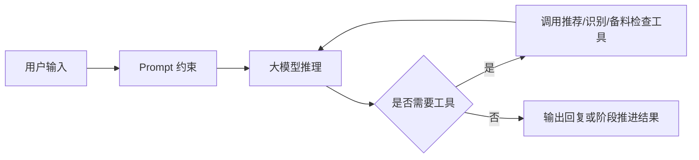
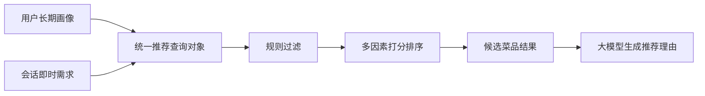

# ChefMate 智能方法调研报告

## 1. 智能任务拆分

ChefMate 的智能能力并不是一个单模型独立完成全部任务，而是拆分为四类核心子任务：

| 子任务 | 目标 |
| --- | --- |
| 对话理解与任务推进 | 理解用户自然语言需求，决定下一步动作，并调用相应工具 |
| 菜品推荐 | 将长期用户画像与即时需求融合，输出候选菜品及推荐理由 |
| 食材图像识别 | 识别用户摆放出来的食材种类，为备料判断提供依据 |
| 烹饪指导生成 | 将结构化菜谱组织为分步骤、可追问、可提醒的过程化指导 |

因此，本项目采用“多能力协同”的智能方法路线，而不是试图让单一模型直接端到端包办所有功能。

## 2. 方法选型

### 2.1 总体方法路线

项目总体方法路线为：

**大模型 + Prompt 工程 + ReAct + 工作流编排 + 外部工具调用 + 长期记忆**

其含义是：

- 大模型负责自然语言理解、推理、解释与步骤组织
- Prompt 工程负责约束输出格式、减少歧义并提高稳定性
- ReAct 负责让模型在推理中穿插行动，动态调用推荐、识别和备料检查等工具
- 工作流编排负责保证关键任务链条可控，而不是完全放任自由代理
- 长期记忆负责维护用户偏好，使推荐和对话持续个性化

### 2.2 为什么不采用“单一大模型端到端硬做”

单纯依赖一个通用大模型直接完成推荐、识别、步骤调整和记忆维护，会有以下问题：

- 推荐依据不够结构化，结果可解释性弱
- 图像识别任务需要稳定视觉检测，不适合完全依赖自然语言模型猜测
- 会话长期记忆若完全依赖上下文拼接，成本高且不稳定
- 多阶段任务如果缺少显式流程控制，容易出现跳步骤和状态混乱

因此，本项目采用“LLM 负责决策与解释，专门模块负责结构化能力”的组合方案。

### 2.3 对话智能体方法选型

#### 2.3.1 采用 ReAct 的原因

ReAct 方法由 Yao 等人在 2022 年提出，核心思想是让模型在推理轨迹中交替生成“思考”和“行动”，从而在需要时调用外部工具，而不是只在文本内部空想推理。对于 ChefMate 来说，这种方式非常适合以下场景：

- 用户表达模糊需求时，先理解再决定调用推荐服务
- 用户上传图片后，决定调用图像识别服务
- 备料不足时，决定调用缺料检查与换菜逻辑
- 做饭中途提问时，根据当前步骤和上下文继续推进

换句话说，ReAct 特别适合“用户输入不确定，但系统动作集合相对明确”的任务链。

#### 2.3.2 为什么还要结合工作流编排

仅靠自由式 agent 虽然灵活，但在工程上容易出现不可预测行为。LangGraph 官方文档明确强调，其核心价值在于构建可控、可恢复、具备状态管理能力的长流程智能体；对于结构清晰的业务任务，确定性工作流与智能节点结合，通常比完全自治代理更稳定。

本项目的做饭任务正好具备这种特征：

- 阶段清晰：选菜、备料、做菜
- 可调用工具集合明确
- 某些步骤有严格前后依赖

因此，本项目更适合采用：

- **外层工作流控制阶段**
- **内层大模型通过 ReAct 决定具体工具使用**

这种“工作流 + ReAct”的混合方式，在灵活性和稳定性之间更平衡。

在工程实现上，推荐使用 `FastAPI + LangGraph + LangChain 组件` 的组合：

- `FastAPI` 负责统一 HTTP 接口、流式响应、文件上传和任务状态查询
- `LangGraph` 负责工作流编排、状态机和长任务恢复
- `LangChain` 只作为 Prompt、模型与工具抽象层，而不是整个系统的总控制器

### 2.4 推荐方法选型

#### 2.4.1 主选方案

推荐模块采用“长期用户画像与会话即时需求融合”的混合推荐方案。

整体流程如下：

1. 从数据库读取用户长期画像
2. 由对话理解模块把自然语言请求转为结构化即时需求
3. 将长期画像与即时需求融合为统一推荐查询对象
4. 根据结构化菜谱特征做规则过滤
5. 按多因素打分完成候选排序
6. 把排序结果交给大语言模型生成推荐解释与任务衔接文本

#### 2.4.2 为什么不采用纯生成式推荐

纯生成式推荐虽然表达自然，但存在几个问题：

- 结果可控性较差
- 不能稳定依赖显式特征做过滤
- 不利于后续做排序调参与离线评估

相比之下，结构化推荐方案更适合当前项目阶段：

- 逻辑清楚，便于实现
- 可解释性强
- 可以直接接入用户偏好与菜谱属性
- 便于后续从规则打分升级到机器学习排序模型

#### 2.4.3 推荐适用场景

该推荐方法适用于：

- 用户不知道吃什么，只给出模糊需求
- 用户说明健康目标、时长限制、工具限制
- 用户希望优先利用现有食材
- 用户在缺料后希望换一个更容易完成的菜

### 2.5 图像识别方法选型

#### 2.5.1 主选方案

图像识别模块采用 YOLO 系列检测方案，当前工程实现优先考虑 Ultralytics 生态的 YOLO11 训练和部署链路。

说明：

- 截至 2026 年 3 月，Ultralytics 官方文档中 YOLO26 已被列为最新版本，但官方同时说明 YOLO26 和 YOLO11 都适合稳定生产负载
- 考虑到项目现阶段更看重成熟训练流程、社区资料和二次开发便利性，优先使用 YOLO 系列成熟版本更稳妥

#### 2.5.2 为什么选择 YOLO

YOLO 方案适合本项目的原因包括：

- 推理速度快，适合实时交互
- 工程工具链成熟，训练和部署门槛较低
- 小样本增量训练资料较丰富
- 对“识别摆放出的主要食材种类”这一任务目标足够合适

#### 2.5.3 任务边界说明

当前图像识别模块的目标是：

- 识别用户摆放在台面上的食材种类

当前不把以下能力作为首期刚性目标：

- 精确估计食材重量
- 冰箱复杂遮挡场景下的高精度识别
- 熟食成品级别的营养估算

这样做的原因是：当前项目的主要任务是辅助备料，而不是构建高难度全场景视觉感知系统。

### 2.6 烹饪指导方法选型

烹饪指导采用“结构化菜谱库 + 大模型组织生成”的方式。

具体思路：

- 菜谱库中预先保存结构化步骤、食材和时长信息
- 大模型读取结构化信息后，按照当前阶段、当前食材重量和用户提问上下文，生成更自然的步骤化指导文本
- 当步骤包含等待时间时，由系统创建计时提醒，不把计时完全依赖模型自然语言输出

这种方式比“完全现编菜谱”更稳，也比“死板展示固定菜谱文本”更灵活。

### 2.7 与当前主流技术的关系

结合近两年的公开文档与官方资料，当前与本项目最相关的主流技术趋势包括：

1. 工作流驱动的 Agent 系统
2. 工具调用和结构化输出
3. 多模态输入支持
4. 检测模型轻量化与高实时性部署
5. 结构化检索与大模型解释结合的混合推荐

本项目并不追求“把所有最新技术都塞进去”，而是只吸收与任务强相关、并且工程上可落地的部分。

### 2.8 智能体运行架构选择

在系统落地形态上，本项目采用模块化单体智能体架构，而不是一开始拆成多个独立微服务。

选择理由如下：

- 当前课程项目更需要保证任务链闭环和开发效率
- 推荐模块、图像识别模块和智能体编排都依赖 Python 生态，统一在一个后端中实现更利于调试
- 若一开始拆成多个独立服务，会增加接口联调、状态同步和部署管理复杂度

因此，当前建议的运行结构为：

- 前端：Vue3
- 后端：FastAPI
- 智能体编排：LangGraph
- 模型与工具抽象：LangChain 组件
- 推荐、食材识别、备料检查、烹饪指导：以后端内部技能模块的方式集成

这种方式属于“模块化单体”，内部保持清晰模块边界，后续若图像识别或推荐模块负载明显上升，再进一步服务化拆分。

## 3. 模型采用的训练数据

## 3.1 菜谱与推荐数据

### 3.1.1 数据来源

项目计划以 [HowToCook](https://github.com/Anduin2017/HowToCook) 为基础，构建自有高质量中文菜谱数据集。

处理方式为：

1. 从公开菜谱文本中提取基础菜谱内容
2. 统一整理为结构化字段
3. 通过 AI 辅助标注补充推荐相关字段
4. 由人工进行抽样校验和规则修正

### 3.1.2 数据内容

菜谱数据的核心字段包括：

- 菜名
- 菜谱简介
- 食材列表
- 食材参考重量
- 步骤列表
- 预计时长
- 难度
- 推荐特征字段

当前计划使用的推荐标签字段包括：

1. `flavor_preferences`：口味偏好
2. `dietary_restrictions`：忌口/过敏
3. `health_goal`：健康目标
4. `cooking_skill_level`：做饭熟练度
5. `max_cook_time`：可接受做饭时长
6. `available_tools`：常用厨具

### 3.1.3 数据规模

当前项目阶段，计划构建数百条规模的高质量中文结构化菜谱数据集，适合作为课程项目和实验验证基础。

建议在报告中表述为：

- 首期构建数百条高质量中文菜谱样本
- 优先覆盖家常菜、高频快手菜和基础入门菜品

这种规模虽然不属于工业级海量数据，但对于验证推荐逻辑、结构化菜谱设计和智能体任务衔接已经足够。

## 3.2 用户画像与会话需求数据

推荐模块除菜谱库外，还依赖两类动态数据：

### 3.2.1 用户长期画像数据

包括：

- 口味偏好
- 忌口/过敏
- 健康目标
- 做饭熟练度
- 可接受时长
- 常用厨具

这些数据既可以由用户手动填写，也可以由大模型在多轮聊天中逐步归纳更新。

### 3.2.2 会话即时需求数据

即时需求来自用户当前消息，例如：

- 今晚想吃清淡一点
- 只有二十分钟
- 现在只有鸡蛋和番茄
- 我不想用油太多

系统会把这些自然语言条件转换为结构化查询对象，再与长期画像融合。

## 3.3 图像识别数据

### 3.3.1 主数据集

项目图像识别部分采用 [FoodSeg103](https://huggingface.co/datasets/EduardoPacheco/FoodSeg103) 和其原始 Benchmark 资料作为公开基础数据来源。

根据公开数据说明：

- 数据集包含 7,118 张图像
- 其中训练集 4,983 张，测试/验证集 2,135 张
- 包含 103 个食材类别
- 提供像素级标注

该数据集的价值在于：

- 食材类别较细
- 适合作为食物图像理解的公开基准
- 能为本项目的食材种类识别提供初始训练基础

### 3.3.2 自补充数据

FoodSeg103 更偏基准数据，而本项目的真实场景是“用户把食材摆在台面上拍照”。因此，仅依赖公开数据集并不够，还需要补充自建样本。

自补充数据重点包括：

- 台面摆放场景
- 多食材同时出现的组合场景
- 家庭厨房常见拍摄角度
- 本项目重点菜谱中高频食材

这样做的原因是让训练分布更贴近项目真实使用场景。

## 4. 模型方法

### 4.1 对话智能体模型方法

#### 4.1.1 模型结构

对话智能体本质上不是一个单独训练的新模型，而是一套由大模型 API、Prompt、工作流和工具组成的系统结构。

可概括为：

其核心原理是：

- 通过系统提示词限定角色、阶段与输出风格
- 通过 ReAct 让模型在思考与行动之间切换
- 通过工具调用获得外部真实信息
- 通过工作流控制阶段边界
- 通过长期记忆保存稳定用户偏好

#### 4.1.2 适用场景

适用于：

- 任务型多轮对话
- 明确工具集合下的阶段推进
- 需要推荐解释和自然语言衔接的业务系统

#### 4.1.3 可优化方向

- Prompt 精炼与少样本示例补充
- 增强长期记忆提取策略
- 增加结构化输出校验
- 对高频任务建立路由式工作流
- 对关键节点增加失败重试与兜底逻辑

### 4.2 推荐模型方法

#### 4.2.1 结构设计

推荐模块采用“规则过滤 + 多因素打分”的结构化方法。

可抽象为：

#### 4.2.2 原理说明

1. 规则过滤阶段

- 先剔除明显不满足条件的菜谱
- 如厨具不满足、时长明显超限、与严重忌口冲突

2. 多因素打分阶段

- 对保留下来的菜谱计算综合得分
- 典型因子包括食材匹配度、口味偏好匹配度、健康目标匹配度、时长适配性、厨具适配性

3. 解释生成阶段

- 将结构化推荐结果交给大模型
- 输出“为什么推荐这些菜”和“下一步怎么选”的自然语言说明

#### 4.2.3 适用场景

适用于：

- 数据量暂时不大，但字段清晰
- 需要较强解释性
- 需要快速迭代规则和权重

#### 4.2.4 可优化方向

- 从人工权重过渡到学习排序模型
- 增加用户行为反馈闭环
- 引入向量召回或语义匹配增强候选覆盖
- 引入更多场景标签，如餐次、人数、预算

### 4.3 图像识别模型方法

#### 4.3.1 模型结构

图像识别模块采用 YOLO 检测框架。

YOLO 的基本思想是：

- 将目标检测视为单阶段回归问题
- 直接从输入图像预测目标框与类别
- 在一次前向推理中同时完成定位和分类

相比两阶段检测器，YOLO 在速度和工程简洁性上更有优势，更适合本项目的实时交互需求。

#### 4.3.2 为什么适合本项目

- 用户拍照后希望快速返回结果
- 项目当前识别目标是“食材种类”，不是高精度语义分割竞赛
- 工程上更容易训练、导出和部署

#### 4.3.3 与 FoodSeg103 的关系

FoodSeg103 原本是分割数据集，而本项目若采用 YOLO 检测路线，需要做数据适配：

- 从原有标注中提取或转换为检测训练格式
- 补充自建台面场景数据
- 对重点食材类别做重采样或再标注

也就是说，公开数据集提供的是“起点”，不是可以直接拿来零改动上线的终态数据。

#### 4.3.4 可优化方向

- 比较 YOLO11n、YOLO11s 与更大模型的效果差异
- 通过数据增强适应厨房拍摄环境
- 增强多食材遮挡场景表现
- 结合分割模型提升复杂场景识别能力

### 4.4 烹饪指导生成方法

#### 4.4.1 模型结构

烹饪指导不是单独训练一个“做菜模型”，而是由大模型读取结构化菜谱后生成阶段化说明。

输入包括：

- 当前目标菜谱
- 当前食材重量
- 当前步骤位置
- 用户当前问题

输出包括：

- 当前该做什么
- 注意事项
- 是否需要计时
- 下一步建议

#### 4.4.2 原理说明

核心原理是将结构化信息转成任务上下文，再由大模型生成适合当前场景的自然语言指导。这样既保留结构化约束，又保留语言表达灵活性。

#### 4.4.3 可优化方向

- 为高频步骤建立模板化提示
- 强化危险操作提示
- 建立“食材重量变化 -> 步骤用量调整”规则层
- 引入多模态理解处理用户上传的锅内状态图片

## 5. 方法选型结论

综合当前任务目标、工程可落地性和课程项目规模，本项目最终选择以下主方案：

| 任务 | 主方案 |
| --- | --- |
| 对话智能体 | 大模型 API + Prompt + ReAct + 工作流编排 |
| 框架实现 | FastAPI + LangGraph + LangChain 组件 |
| 推荐 | 长期画像与即时需求融合的结构化混合推荐 |
| 排序方式 | 规则过滤 + 多因素打分 |
| 图像识别 | YOLO 检测方案 |
| 图像数据 | FoodSeg103 + 自补充台面食材数据 |
| 菜谱数据 | HowToCook 基础上自建高质量中文结构化菜谱集 |
| 烹饪指导 | 结构化菜谱库 + 大模型组织生成 |

这一组合方案的优点是：

- 任务边界清晰
- 工程复杂度可控
- 结果可解释
- 后续可持续优化

## 6. 后续可进一步调优的方向

### 6.1 对话智能体

- 增加更细的阶段路由
- 增强长期记忆更新质量
- 引入更严格的结构化输出校验

### 6.2 推荐模块

- 由规则打分升级到学习排序
- 引入更多用户反馈信号
- 增加换菜策略和替代方案策略

### 6.3 图像识别模块

- 从单纯检测升级到检测加分割协同
- 增强复杂遮挡、多目标和厨房弱光场景的鲁棒性
- 扩充自建数据类别覆盖度

### 6.4 烹饪指导模块

- 引入锅内状态图片理解
- 强化计时与提醒的时序联动
- 增加针对新手的错误恢复建议

## 7. 参考资料

以下资料用于确认当前技术口径和数据集信息：

- LangGraph 官方文档：
  [LangGraph Overview](https://docs.langchain.com/oss/python/langgraph/overview)
- LangChain 官方文档：
  [LangChain Overview](https://docs.langchain.com/oss/python/langchain/overview)
- FastAPI 官方文档：
  [FastAPI Tutorial](https://fastapi.tiangolo.com/tutorial/)
  [Background Tasks](https://fastapi.tiangolo.com/de/reference/background/)
- Ultralytics 官方文档：
  [Ultralytics YOLO Docs](https://docs.ultralytics.com/)
- HowToCook 仓库：
  [Anduin2017/HowToCook](https://github.com/Anduin2017/HowToCook)
- FoodSeg103 基准仓库：
  [FoodSeg103-Benchmark-v1](https://github.com/LARC-CMU-SMU/FoodSeg103-Benchmark-v1)
- FoodSeg103 数据集卡片：
  [Hugging Face FoodSeg103](https://huggingface.co/datasets/EduardoPacheco/FoodSeg103)
