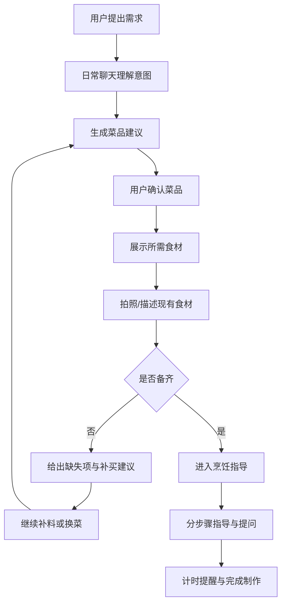
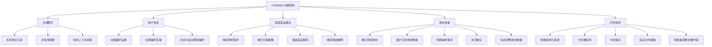
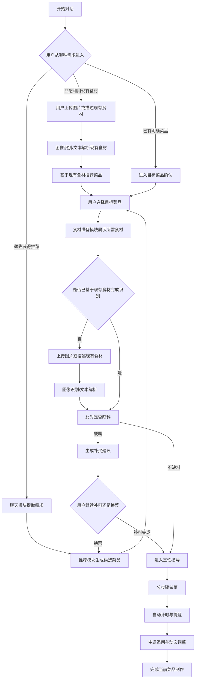
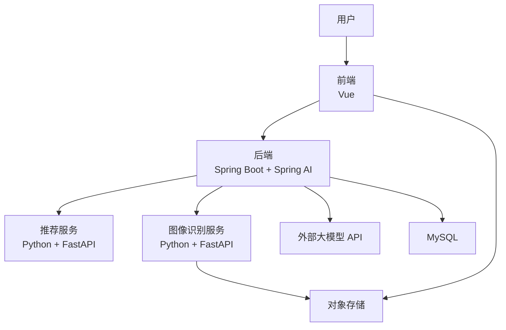

# ChefMate 概要设计报告

## 1. 需求功能点概述

### 1.1 项目目标

ChefMate 是一个面向日常做饭场景的智能烹饪助手。系统并不只负责展示菜谱，而是希望围绕一次做饭任务，帮助用户完成以下连续过程：

1. 不知道吃什么时获得建议
2. 确定目标菜品
3. 明确所需食材和准备事项
4. 通过文字或图片确认手头已有食材
5. 判断是否缺料
6. 缺料时给出补买建议，必要时支持换菜
7. 食材齐备后提供分步骤烹饪指导

### 1.2 当前核心需求功能点

根据项目现阶段边界，系统的核心需求功能点包括：

- 日常聊天：允许用户以自然语言提出任务相关问题，也支持在未明确任务时进行闲聊
- 用户信息：记录并维护用户长期偏好，包括口味、忌口、过敏、健康目标、常用厨具、可接受做饭时长和做饭熟练度
- 获取菜品建议：结合长期用户画像与当前对话需求，为用户推荐候选菜品，并给出推荐理由
- 食材准备：展示所需食材，识别用户当前摆放出的食材，判断缺料情况，并支持动态调整食材重量
- 烹饪指导：围绕目标菜品提供可跟随的步骤指导，支持中途提问、内容微调和自动计时提醒

### 1.3 核心业务主线

该主线体现的是系统当前最核心的闭环场景，但系统并不要求用户严格从头开始。用户也可以直接从“我想做番茄炒蛋”“我现在有这些食材”“告诉我下一步怎么做”等任意阶段进入。

## 2. 系统功能设计

### 2.1 功能结构图

### 2.2 功能模块描述

#### 2.2.1 日常聊天模块

该模块负责接收用户的自然语言输入，是整个系统的统一入口。它既要处理“今晚吃什么”“我想吃清淡一点”这类任务表达，也要支持用户在暂时没有明确任务时进行轻量闲聊，并在合适时机把对话引回做饭任务。

模块职责包括：

- 识别用户当前是否在表达任务需求
- 承接多轮上下文，避免重复询问已知条件
- 将自然语言中的意图、限制条件和场景信息传递给后续模块

#### 2.2.2 用户信息模块

该模块用于维护用户长期偏好信息，是推荐个性化的基础。

模块职责包括：

- 支持用户初次使用时手动设置偏好
- 保存口味偏好、忌口过敏、健康目标、做饭熟练度、可接受做饭时长和常用厨具
- 支持大模型在对话中识别稳定偏好并自动更新长期记忆

#### 2.2.3 获取菜品建议模块

该模块负责把用户长期画像与当前即时需求融合，输出候选菜品列表，并向用户解释推荐原因。

模块职责包括：

- 解析用户当前对口味、时间、健康、食材和工具的要求
- 结合长期偏好形成统一推荐查询对象
- 基于结构化菜谱数据召回候选菜品
- 按多因素打分完成排序
- 生成面向用户可理解的推荐理由

#### 2.2.4 食材准备模块

该模块在用户确定目标菜品后工作，目标是帮助用户弄清楚“要准备什么”“我现在有没有”“缺什么”。

模块职责包括：

- 展示该菜品所需食材及参考重量
- 支持用户上传摆放好的食材图片，识别主要食材种类
- 对已有食材与所需食材进行比对
- 给出缺失食材与补买建议
- 当用户主动说明调整份量时，动态更新所需食材重量
- 当重量发生变化时，同步调整展示给用户的菜谱内容

说明：

- 替代食材建议不作为默认主动输出项，而是在用户主动提出替换需求时再返回
- 当前阶段图片识别以“识别食材种类”为目标，不把从图片估计准确克重作为设计目标

#### 2.2.5 烹饪指导模块

该模块在食材条件满足后工作，负责将菜谱转化为更适合实际下厨跟随的过程化指导。

模块职责包括：

- 展示结构化菜谱内容
- 以分步骤方式输出当前操作、下一步和注意事项
- 支持用户在做饭过程中继续提问
- 当步骤需要等待时自动开启倒计时并提醒
- 根据食材重量变化微调展示的步骤内容和用量说明

### 2.3 业务流程图

该流程图包含两类常见入口：一类是先表达想吃什么，再由系统推荐或确认目标菜品；另一类是用户先提供现有食材，由系统直接基于现有条件推荐可做菜品。两条路线在用户选定目标菜品后汇合，并进入统一的备料检查与烹饪指导流程。

## 3. 系统技术架构设计

### 3.1 总体技术架构

系统采用前后端分离架构，前端负责展示与交互，Spring Boot 后端负责会话管理、业务编排、模型调用和数据组织；推荐服务与图像识别服务作为独立 Python 服务提供专门能力；大模型通过外部 API 接入。

### 3.2 技术分层说明

#### 3.2.1 前端表示层

前端采用 Vue 构建，主要负责：

- 聊天界面展示
- 候选菜品结果展示
- 食材准备页与上传交互
- 分步骤烹饪指导页
- 倒计时与提醒交互

前端需要兼顾 PC 和移动端浏览器，以满足用户在厨房环境下的使用需求。

#### 3.2.2 后端业务编排层

后端采用 Spring Boot，结合 Spring AI 作为智能体编排框架。

主要职责包括：

- 会话创建与管理
- 用户长期偏好维护
- 多轮上下文组织
- 调用大模型 API
- 调用推荐服务和图像识别服务
- 将结构化结果转换为前端可消费的数据
- 管理阶段状态与步骤推进

选择 Spring AI 的原因：

- 与 Spring Boot 生态兼容度高
- 便于统一接入模型、工具调用和记忆机制
- 适合实现工作流编排与多工具协同

#### 3.2.3 推荐服务层

推荐服务采用 Python + FastAPI，负责：

- 读取结构化菜谱特征
- 组织长期画像和即时需求
- 执行规则过滤与多因素打分
- 输出候选菜品及打分结果

将推荐模块独立为 Python 服务，有利于后续单独迭代推荐策略、模型实验和离线评估。

#### 3.2.4 图像识别服务层

图像识别服务采用 Python + FastAPI，负责：

- 接收用户上传的食材图片
- 执行食材检测与识别
- 返回识别到的主要食材种类

当前阶段的设计目标是识别“摆放出来的食材种类”，不把“冰箱复杂场景”作为首期必须完成能力。

#### 3.2.5 外部模型能力层

系统通过外部大模型 API 完成自然语言理解、ReAct 推理、推荐解释、分步骤指导生成和多轮问答。系统不在当前阶段自行训练通用大模型，而是通过 Prompt 工程、工具调用和工作流编排来提升任务表现。

### 3.3 软硬件平台与开发环境

#### 3.3.1 软件平台

| 类别 | 选型 |
| --- | --- |
| 前端框架 | Vue |
| 后端框架 | Spring Boot |
| 智能体框架 | Spring AI |
| 推荐服务 | Python + FastAPI |
| 图像识别服务 | Python + FastAPI |
| 数据库 | MySQL |
| 图片存储 | 对象存储 |
| 大模型接入 | 外部 API |

#### 3.3.2 硬件平台

| 场景 | 平台说明 |
| --- | --- |
| 开发阶段 | 本地开发机 |
| 部署阶段 | 云服务器 |

说明：

- 当前概要设计仅展开开发环境，不对生产环境高可用、灰度发布和容灾做进一步设计
- 如后续图像识别训练规模增大，可再补充 GPU 训练机设计

#### 3.3.3 开发环境建议

| 项目 | 建议版本 |
| --- | --- |
| JDK | 17 或以上 |
| Node.js | 18 或以上 |
| Python | 3.10 或以上 |
| MySQL | 8.x |
| 构建工具 | Maven / pnpm 或 npm |

## 4. 系统数据结构设计

### 4.1 数据设计原则

系统数据结构设计遵循以下原则：

- 以任务过程为中心，而不是只围绕静态内容存储
- 长期偏好与即时会话分开存储
- 菜谱内容结构化，便于推荐和步骤调整
- 对话消息和阶段状态持久化，支持恢复上下文
- 图片文件与结构化业务数据分离存储

### 4.2 核心数据对象

| 数据对象 | 作用 |
| --- | --- |
| 用户 `user` | 存储用户基础信息 |
| 用户偏好 `user_profile` | 存储口味、忌口、过敏、健康目标、厨具、时长、熟练度等长期偏好 |
| 对话 `conversation` | 存储一次做饭任务的会话元数据 |
| 消息 `message` | 存储用户消息与系统消息 |
| 消息卡片 `message_card` | 存储与消息关联的结构化展示内容 |
| 会话阶段 `conversation_stage` | 记录当前对话所处阶段 |
| 菜谱 `recipe` | 存储菜谱基础信息 |
| 菜谱食材 `recipe_ingredient` | 存储菜谱所需食材及参考重量 |
| 菜谱步骤 `recipe_step` | 存储菜谱步骤、顺序、时长和提示信息 |
| 识别结果 `ingredient_detection_result` | 存储图像识别得到的食材种类结果 |
| 推荐结果 `recommendation_result` | 存储候选菜品和打分结果 |

### 4.3 主要数据表设计

#### 4.3.1 用户与偏好相关表

`user`

| 字段 | 说明 |
| --- | --- |
| id | 用户主键 |
| username | 用户名 |
| created_at | 创建时间 |
| updated_at | 更新时间 |

`user_profile`

| 字段 | 说明 |
| --- | --- |
| id | 主键 |
| user_id | 用户 ID |
| flavor_preferences | 口味偏好 |
| dietary_restrictions | 忌口/过敏 |
| health_goal | 健康目标 |
| cooking_skill_level | 做饭熟练度 |
| max_cook_time | 可接受做饭时长 |
| available_tools | 常用厨具 |
| updated_by | 手动更新或模型更新 |
| updated_at | 更新时间 |

#### 4.3.2 会话相关表

`conversation`

| 字段 | 说明 |
| --- | --- |
| id | 对话主键 |
| user_id | 用户 ID |
| title | 对话标题 |
| current_stage | 当前阶段 |
| target_recipe_id | 当前目标菜谱 ID |
| status | 进行中/已完成 |
| created_at | 创建时间 |
| updated_at | 更新时间 |

`message`

| 字段 | 说明 |
| --- | --- |
| id | 消息主键 |
| conversation_id | 所属对话 ID |
| role | user / assistant / system |
| content | 消息内容 |
| message_type | 文本/图片/系统结果 |
| created_at | 创建时间 |

`message_card`

| 字段 | 说明 |
| --- | --- |
| id | 卡片主键 |
| conversation_id | 所属对话 ID |
| message_id | 关联消息 ID |
| card_type | 推荐卡片/备料卡片/烹饪卡片 |
| card_payload | 卡片结构化 JSON |
| is_active | 当前是否激活 |
| created_at | 创建时间 |

说明：

- 一个对话中可以关联多条消息和多张消息卡片
- 同一时刻前端只展示当前激活卡片，但历史卡片仍可保留

#### 4.3.3 菜谱相关表

`recipe`

| 字段 | 说明 |
| --- | --- |
| id | 菜谱主键 |
| name | 菜名 |
| description | 菜谱简介 |
| difficulty | 难度 |
| estimated_time | 预计耗时 |
| instructions_json | 结构化菜谱 JSON |
| created_at | 创建时间 |

`recipe_ingredient`

| 字段 | 说明 |
| --- | --- |
| id | 主键 |
| recipe_id | 菜谱 ID |
| ingredient_name | 食材名称 |
| reference_amount | 参考重量或份量 |
| unit | 单位 |
| is_required | 是否关键食材 |

`recipe_step`

| 字段 | 说明 |
| --- | --- |
| id | 主键 |
| recipe_id | 菜谱 ID |
| step_no | 步骤序号 |
| title | 步骤标题 |
| instruction | 步骤说明 |
| timer_seconds | 是否需要计时及参考秒数 |
| tips | 注意事项 |

#### 4.3.4 推荐与识别相关表

`recommendation_result`

| 字段 | 说明 |
| --- | --- |
| id | 主键 |
| conversation_id | 对话 ID |
| recipe_id | 菜谱 ID |
| score | 综合得分 |
| reason_text | 推荐理由 |
| created_at | 创建时间 |

`ingredient_detection_result`

| 字段 | 说明 |
| --- | --- |
| id | 主键 |
| conversation_id | 对话 ID |
| image_url | 图片地址 |
| detected_items_json | 识别出的食材列表 |
| created_at | 创建时间 |

### 4.4 数据存储设计

| 数据类型 | 存储方式 |
| --- | --- |
| 结构化业务数据 | MySQL |
| 图片文件 | 对象存储 |
| 菜谱步骤结构 | MySQL JSON 字段或拆分表 |
| 会话消息 | MySQL |
| 用户长期偏好 | MySQL |

## 5. 接口设计

### 5.1 接口设计原则

- 前后端之间采用前后端分离接口调用方式
- 后端对前端提供统一业务接口
- 推荐服务和图像识别服务通过内部 HTTP 接口与后端通信
- 当前阶段只设计简单接口清单，不展开完整接口文档

### 5.2 前后端主要接口清单

| 接口 | 方法 | 说明 |
| --- | --- | --- |
| `/api/conversations` | `POST` | 新建对话 |
| `/api/conversations/{id}/messages` | `POST` | 发送消息 |
| `/api/conversations/{id}/messages` | `GET` | 获取对话消息列表 |
| `/api/conversations/{id}/cards` | `GET` | 获取当前卡片及历史卡片 |
| `/api/users/profile` | `GET` | 获取用户偏好信息 |
| `/api/users/profile` | `PUT` | 更新用户偏好信息 |
| `/api/recommendations` | `POST` | 获取候选菜品推荐 |
| `/api/recipes/{id}` | `GET` | 获取菜谱详情 |
| `/api/ingredient-detection` | `POST` | 上传图片并识别食材 |
| `/api/preparation/check` | `POST` | 检查备料是否齐全 |
| `/api/cooking/guide` | `POST` | 获取分步骤烹饪指导 |

### 5.3 后端与内部服务接口清单

#### 5.3.1 推荐服务接口

| 接口 | 方法 | 说明 |
| --- | --- | --- |
| `/internal/recommend/query` | `POST` | 输入用户画像与即时需求，返回候选菜品及打分结果 |

#### 5.3.2 图像识别服务接口

| 接口 | 方法 | 说明 |
| --- | --- | --- |
| `/internal/vision/detect-ingredients` | `POST` | 输入食材图片，返回识别到的食材种类 |
