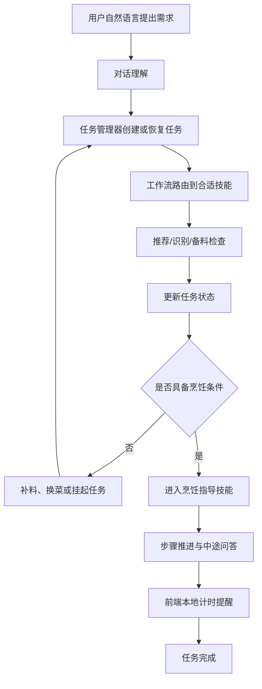
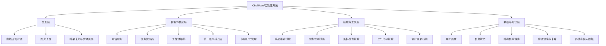
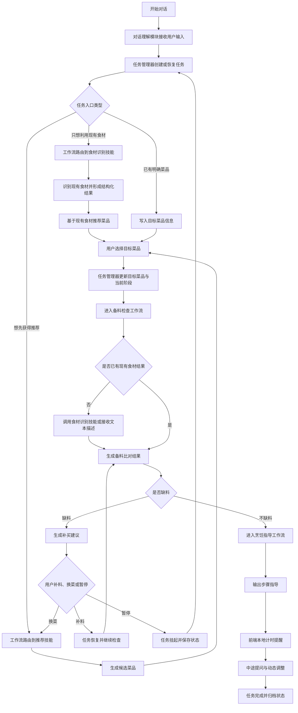
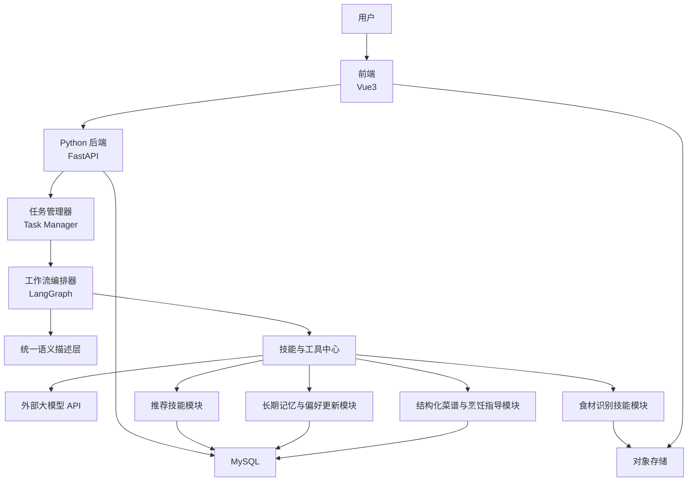

# ChefMate 概要设计报告

## 1. 需求功能点概述

### 1.1 项目目标

ChefMate 是一个面向日常做饭场景的智能烹饪助手。系统并不只负责展示菜谱，而是希望围绕一次做饭任务，帮助用户完成以下连续过程：

1. 不知道吃什么时获得建议
2. 确定目标菜品
3. 明确所需食材和准备事项
4. 通过文字或图片确认手头已有食材
5. 判断是否缺料
6. 缺料时给出补买建议，必要时支持换菜
7. 食材齐备后提供分步骤烹饪指导

### 1.2 当前核心需求功能点

根据项目现阶段边界，系统的核心需求功能点包括：

- 自然语言交互：用户通过自然语言表达需求，而不是自行寻找按钮和拼接功能流程
- 对话理解与任务推进：系统需要将用户表达转换为可执行的阶段性任务，并持续推进任务状态
- 任务管理：系统需能够创建任务、跟踪阶段、暂停任务、恢复任务，并记录当前执行节点
- 用户信息与长期记忆：记录并动态维护口味偏好、忌口过敏、健康目标、常用厨具、做饭熟练度和时长偏好
- 菜品推荐技能：结合长期画像与即时需求，输出候选菜品及推荐理由
- 食材理解与备料技能：识别用户提供的现有食材，判断是否缺料，并支持动态调整重量与备料状态
- 烹饪指导技能：围绕目标菜品提供分步骤指导、中途答疑和前端自动计时提醒
- 统一语义描述：在前端、任务管理、工具调用和数据库之间使用一致的业务对象和字段定义

与传统 Web 程序不同，ChefMate 并不要求用户自己决定“先点哪个页面、再调用哪个功能”，而是由智能体先理解需求，再由任务管理模块驱动工作流与技能调用，最终完成从需求表达、菜品决策到烹饪指导的完整任务闭环。

### 1.3 核心业务主线

该主线体现了系统从“自然语言输入”到“任务对象创建”、再到“工作流驱动技能执行”的核心逻辑。用户不需要自己决定功能调用顺序，而是由系统根据当前任务状态自主推进下一步。

## 2. 系统功能设计

### 2.1 功能结构图

### 2.2 功能模块描述

#### 2.2.1 对话理解模块

该模块是智能体的统一输入入口，负责接收用户文本和图片说明，并判断用户当前是在发起新任务、补充已有任务、还是仅进行普通交流。

模块职责包括：

- 从自然语言中抽取意图、约束条件和场景信息
- 将口语化表达转换为系统内部统一语义对象
- 将解析结果提交给任务管理器决定下一步执行路径

#### 2.2.2 任务管理模块

该模块是系统的核心控制部件，用于管理一次做饭任务在整个生命周期中的状态变化。

模块职责包括：

- 创建新任务，并为任务分配唯一任务标识
- 记录当前任务阶段、目标菜品、已知约束和执行进度
- 支持任务挂起、恢复、改道和完成
- 将当前任务状态持久化，便于用户中断后继续执行

该模块对应“任务管理引擎”，其作用不是简单存一条聊天记录，而是负责把“用户需求”变成“可持续推进的任务对象”。

#### 2.2.3 工作流编排模块

该模块负责把已知且固定的业务逻辑组织为确定性工作流，避免大模型端到端自由控制整个系统。

模块职责包括：

- 根据任务状态路由到合适的技能节点
- 约束推荐、备料检查、缺料处理和烹饪指导的执行顺序
- 在必要时调用大模型进行补充推理，而不是让其随意改写流程
- 对关键节点设置可恢复和可重试机制

#### 2.2.4 统一语义描述模块

该模块用于统一前端、任务管理器、工具调用和数据库之间的概念表达，避免同一业务对象在不同层级中含义不一致。

模块职责包括：

- 定义统一的任务对象、用户画像对象、即时需求对象和菜谱对象
- 约束各技能输入输出结构
- 为数据库字段、接口字段和工作流状态提供统一命名

#### 2.2.5 用户信息与长期记忆模块

该模块负责维护用户的长期偏好，是后续推荐与任务推进个性化的基础。

模块职责包括：

- 支持用户初次使用时手动设置偏好
- 记录口味偏好、忌口过敏、健康目标、做饭熟练度、可接受时长和常用厨具
- 在对话过程中识别稳定偏好并更新长期记忆

#### 2.2.6 菜品推荐技能

该技能负责根据用户长期画像和即时需求生成候选菜品，并向任务管理器返回结构化推荐结果。

模块职责包括：

- 解析即时需求
- 融合用户画像
- 基于结构化菜谱特征完成召回和排序
- 输出推荐理由和候选菜品

#### 2.2.7 食材理解与备料技能

该技能负责理解用户现有食材情况，并围绕目标菜品完成备料判断。

模块职责包括：

- 识别用户上传图片中的主要食材种类
- 比对目标菜谱所需食材与用户现有食材
- 输出缺失项、补买建议和备料状态
- 根据用户指定份量动态调整所需食材重量

说明：

- 替代食材建议不作为默认主动输出项，而在用户主动提出替换需求时再触发
- 当前阶段图片识别以“识别摆放食材种类”为目标，不把图片估算精确重量作为刚性要求

#### 2.2.8 烹饪指导技能

该技能负责把结构化菜谱转化为可执行、可追问、可推进的过程化指导。

模块职责包括：

- 输出当前步骤、下一步和关键注意事项
- 在用户提问时结合当前任务状态继续解释
- 根据重量变化调整步骤说明
- 将计时字段交由前端触发本地提醒

### 2.3 业务流程图

该流程图体现了智能体系统的三个关键特征：

- 多入口：用户可以从想法、现有食材或明确菜品三个入口进入系统
- 任务管理：所有入口都会先被转化为任务对象，并由任务管理器记录状态
- 工作流约束：推荐、识别、备料检查和烹饪指导按照既定流程推进，大模型只在需要推理和补充说明时参与

## 3. 系统技术架构设计

### 3.1 总体技术架构

系统采用“Vue3 前端 + Python 智能体后端”的前后端分离架构。后端并非普通业务接口服务器，而是以任务管理器和工作流编排器为核心的智能体运行时系统。大模型在该系统中作为被调用的智能能力节点，而不是直接端到端控制全部业务逻辑。

### 3.2 技术分层说明

#### 3.2.1 前端表示层

前端采用 Vue3 构建，主要负责：

- 聊天界面展示
- 候选菜品结果展示
- 食材准备页与上传交互
- 分步骤烹饪指导页
- 倒计时与提醒交互

前端需要兼顾 PC 和移动端浏览器，以满足用户在厨房环境下的使用需求。

#### 3.2.2 Python 智能体后端

后端采用 FastAPI 作为统一应用框架，负责对外提供接口和承载智能体运行时。

主要职责包括：

- 会话创建与管理
- 任务创建、恢复、挂起与完成
- 工作流执行与节点路由
- 调用大模型 API 与内部技能模块
- 将结构化结果转换为前端可消费的数据
- 管理阶段状态、工具输出和任务事件

选择 FastAPI 的原因：

- 与 LangChain、LangGraph、PyTorch、Ultralytics 等 Python AI 生态集成成本低
- 便于将推荐、图像识别和智能体编排放在同一语言体系中实现
- 适合快速构建异步接口、流式响应和模型调用网关

#### 3.2.3 智能体核心层

智能体核心层由任务管理器、工作流编排器和统一语义描述层构成。

主要职责包括：

- 以任务对象为核心管理一次完整烹饪过程
- 根据任务状态选择工作流节点，而不是让大模型随意决定所有动作
- 将用户输入转换为统一语义对象，例如即时需求、目标菜品、备料状态等
- 对技能输入输出进行结构化约束，减少语义翻译损耗

在框架选择上，推荐使用 LangGraph 作为工作流编排框架，LangChain 组件仅作为模型、Prompt、工具调用的支撑层，而不让 LangChain Agent 直接承担全部系统控制逻辑。

#### 3.2.4 技能与工具层

技能与工具层负责将固定流程或可复用能力封装成可直接调用的技能节点。

当前建议封装的核心技能包括：

- 菜品推荐技能
- 食材识别技能
- 备料检查技能
- 烹饪指导技能
- 偏好更新技能

这种封装方式的意义在于：智能体不需要每次重新思考底层执行细节，而是以“调用技能”的方式完成固定任务。

#### 3.2.5 外部模型与领域能力层

系统通过外部大模型 API 完成自然语言理解、ReAct 推理、推荐解释和步骤化指导生成。推荐逻辑和图像识别模型采用 Python 内部模块实现，在当前阶段作为后端内部技能存在，而不是一开始就拆成独立微服务。

这种设计的原因是：

- 当前项目规模更适合模块化单体，而不是一开始就过度服务拆分
- 推荐与图像识别都依赖 Python 生态，直接放入后端更利于开发和调试
- 后续若负载上升或依赖冲突明显，再将其独立服务化成本更低

### 3.3 软硬件平台与开发环境

#### 3.3.1 软件平台

| 类别 | 选型 |
| --- | --- |
| 前端框架 | Vue3 |
| 后端框架 | FastAPI |
| 工作流编排框架 | LangGraph |
| 模型与工具抽象 | LangChain 组件 |
| 推荐与识别实现 | Python 内部技能模块 |
| 数据库 | MySQL |
| 图片存储 | 对象存储 |
| 大模型接入 | 外部 API |

#### 3.3.2 硬件平台

| 场景 | 平台说明 |
| --- | --- |
| 开发阶段 | 本地开发机 |
| 部署阶段 | 云服务器 |

说明：

- 当前概要设计仅展开开发环境，不对生产环境高可用、灰度发布和容灾做进一步设计
- 如后续图像识别训练规模增大，可再补充 GPU 训练机设计

#### 3.3.3 开发环境建议

| 项目 | 建议版本 |
| --- | --- |
| Node.js | 18 或以上 |
| Python | 3.10 或以上 |
| MySQL | 8.x |
| 构建工具 | pnpm 或 npm |

## 4. 系统数据结构设计

### 4.1 数据设计原则

系统数据结构设计遵循以下原则：

- 以任务过程为中心，而不是只围绕静态内容存储
- 将会话与任务分层建模，会话负责承载交互，任务负责承载执行状态
- 长期偏好与即时会话分开存储
- 技能输入输出采用统一语义对象表示
- 菜谱内容结构化，便于推荐和步骤调整
- 对话消息和阶段状态持久化，支持恢复上下文
- 图片文件与结构化业务数据分离存储

### 4.2 核心数据对象

| 数据对象 | 作用 |
| --- | --- |
| 用户 `user` | 存储用户基础信息 |
| 用户偏好 `user_profile` | 存储口味、忌口、过敏、健康目标、厨具、时长、熟练度等长期偏好 |
| 对话 `conversation` | 存储一次做饭任务的会话元数据 |
| 任务 `task` | 存储一次任务执行的总体状态 |
| 任务节点 `task_node` | 存储任务在工作流中的节点执行记录 |
| 消息 `message` | 存储用户消息与系统消息 |
| 消息卡片 `message_card` | 存储与消息关联的结构化展示内容 |
| 会话阶段 `conversation_stage` | 记录当前对话所处阶段 |
| 统一需求对象 `semantic_query` | 存储结构化后的即时需求描述 |
| 菜谱 `recipe` | 存储菜谱基础信息 |
| 菜谱食材 `recipe_ingredient` | 存储菜谱所需食材及参考重量 |
| 菜谱步骤 `recipe_step` | 存储菜谱步骤、顺序、时长和提示信息 |
| 标签分类 `recipe_tag_category` | 存储固定标签分类 |
| 标签字典 `recipe_tag` | 存储固定标签项、标签编码和 bit 位 |
| 菜谱标签映射 `recipe_tag_map` | 存储菜谱与标签之间的对应关系 |
| 识别结果 `ingredient_detection_result` | 存储图像识别得到的食材种类结果 |
| 推荐结果 `recommendation_result` | 存储候选菜品和打分结果 |

### 4.3 主要数据表设计

#### 4.3.1 用户与偏好相关表

`user`

| 字段 | 说明 |
| --- | --- |
| id | 用户主键 |
| username | 用户名 |
| created_at | 创建时间 |
| updated_at | 更新时间 |

`user_profile`

| 字段 | 说明 |
| --- | --- |
| id | 主键 |
| user_id | 用户 ID |
| flavor_preferences | 口味偏好 |
| dietary_restrictions | 忌口/过敏 |
| health_goal | 健康目标 |
| cooking_skill_level | 做饭熟练度 |
| max_cook_time | 可接受做饭时长 |
| available_tools | 常用厨具 |
| updated_by | 手动更新或模型更新 |
| updated_at | 更新时间 |

#### 4.3.2 会话相关表

`conversation`

| 字段 | 说明 |
| --- | --- |
| id | 对话主键 |
| user_id | 用户 ID |
| title | 对话标题 |
| current_task_id | 当前任务 ID |
| current_stage | 当前阶段 |
| target_recipe_id | 当前目标菜谱 ID |
| status | 进行中/已完成 |
| created_at | 创建时间 |
| updated_at | 更新时间 |

`task`

| 字段 | 说明 |
| --- | --- |
| id | 任务主键 |
| conversation_id | 所属对话 ID |
| task_type | 任务类型，如推荐、备料、烹饪 |
| status | 待执行/进行中/挂起/完成 |
| current_node | 当前工作流节点 |
| target_recipe_id | 当前目标菜谱 ID |
| semantic_query_json | 结构化即时需求 |
| waiting_reason | 挂起原因或等待条件 |
| created_at | 创建时间 |
| updated_at | 更新时间 |

`task_node`

| 字段 | 说明 |
| --- | --- |
| id | 主键 |
| task_id | 任务 ID |
| node_name | 节点名称 |
| node_type | 推荐/识别/备料/烹饪等 |
| input_json | 节点输入 |
| output_json | 节点输出 |
| status | 成功/失败/等待 |
| created_at | 创建时间 |

`message`

| 字段 | 说明 |
| --- | --- |
| id | 消息主键 |
| conversation_id | 所属对话 ID |
| role | user / assistant / system |
| content | 消息内容 |
| message_type | 文本/图片/系统结果 |
| created_at | 创建时间 |

`message_card`

| 字段 | 说明 |
| --- | --- |
| id | 卡片主键 |
| conversation_id | 所属对话 ID |
| message_id | 关联消息 ID |
| task_id | 关联任务 ID |
| card_type | 推荐卡片/备料卡片/烹饪卡片 |
| card_payload | 卡片结构化 JSON |
| is_active | 当前是否激活 |
| created_at | 创建时间 |

说明：

- 一个对话中可以关联多条消息和多张消息卡片
- 同一时刻前端只展示当前激活卡片，但历史卡片仍可保留

#### 4.3.3 菜谱相关表

`recipe`

| 字段 | 说明 |
| --- | --- |
| id | 菜谱主键 |
| name | 菜名 |
| image_path | 菜品图片路径 |
| description | 菜谱简介 |
| difficulty | 难度 |
| estimated_minutes | 预计制作时长（分钟） |
| servings | 默认份量 |
| tips | 补充提示 |
| status | DRAFT / PUBLISHED |
| created_at | 创建时间 |
| updated_at | 更新时间 |

`recipe_ingredient`

| 字段 | 说明 |
| --- | --- |
| id | 主键 |
| recipe_id | 菜谱 ID |
| ingredient_name | 食材名称 |
| amount_value | 数值化数量 |
| amount_text | 原始数量描述 |
| unit | 单位 |
| is_optional | 是否可选 |
| purpose | 用途说明 |
| sort_order | 排序 |

`recipe_step`

| 字段 | 说明 |
| --- | --- |
| id | 主键 |
| recipe_id | 菜谱 ID |
| step_no | 步骤序号 |
| title | 步骤标题 |
| instruction | 步骤说明 |
| timer_seconds | 建议计时秒数 |
| notes | 补充提醒 |

`recipe_tag_category`

| 字段 | 说明 |
| --- | --- |
| id | 主键 |
| category_code | 分类编码 |
| category_name | 分类名称 |
| sort_order | 排序 |

`recipe_tag`

| 字段 | 说明 |
| --- | --- |
| id | 主键 |
| category_id | 分类 ID |
| bit_position | 固定 bit 位 |
| tag_code | 标签编码 |
| tag_name | 标签名称 |
| is_enabled | 是否启用 |
| sort_order | 排序 |

`recipe_tag_map`

| 字段 | 说明 |
| --- | --- |
| recipe_id | 菜谱 ID |
| tag_id | 标签 ID |
| created_at | 创建时间 |

#### 4.3.4 推荐与识别相关表

`recommendation_result`

| 字段 | 说明 |
| --- | --- |
| id | 主键 |
| conversation_id | 对话 ID |
| recipe_id | 菜谱 ID |
| score | 综合得分 |
| reason_text | 推荐理由 |
| created_at | 创建时间 |

`ingredient_detection_result`

| 字段 | 说明 |
| --- | --- |
| id | 主键 |
| conversation_id | 对话 ID |
| image_url | 图片地址 |
| detected_items_json | 识别出的食材列表 |
| created_at | 创建时间 |

### 4.4 数据存储设计

| 数据类型 | 存储方式 |
| --- | --- |
| 结构化业务数据 | MySQL |
| 图片文件 | 对象存储 |
| 菜谱步骤结构 | MySQL JSON 字段或拆分表 |
| 会话消息 | MySQL |
| 用户长期偏好 | MySQL |

## 5. 接口设计

### 5.1 接口设计原则

- 前后端之间采用前后端分离接口调用方式
- 后端对前端提供统一业务接口
- 推荐服务和图像识别服务通过内部 HTTP 接口与后端通信
- 当前阶段只设计简单接口清单，不展开完整接口文档

### 5.2 前后端主要接口清单

| 接口 | 方法 | 说明 |
| --- | --- | --- |
| `/api/conversations` | `POST` | 新建对话 |
| `/api/conversations/{id}/messages` | `POST` | 发送消息 |
| `/api/conversations/{id}/messages` | `GET` | 获取对话消息列表 |
| `/api/conversations/{id}/cards` | `GET` | 获取当前卡片及历史卡片 |
| `/api/tasks/{id}` | `GET` | 获取当前任务状态 |
| `/api/tasks/{id}/resume` | `POST` | 恢复挂起任务 |
| `/api/users/profile` | `GET` | 获取用户偏好信息 |
| `/api/users/profile` | `PUT` | 更新用户偏好信息 |
| `/api/recommendations` | `POST` | 获取候选菜品推荐 |
| `/api/recipes/{id}` | `GET` | 获取菜谱详情 |
| `/api/ingredient-detection` | `POST` | 上传图片并识别食材 |
| `/api/preparation/check` | `POST` | 检查备料是否齐全 |
| `/api/cooking/guide` | `POST` | 获取分步骤烹饪指导 |

### 5.3 后端与内部服务接口清单

#### 5.3.1 推荐服务接口

| 接口 | 方法 | 说明 |
| --- | --- | --- |
| `/internal/recommend/query` | `POST` | 输入用户画像与即时需求，返回候选菜品及打分结果 |

#### 5.3.2 图像识别服务接口

| 接口 | 方法 | 说明 |
| --- | --- | --- |
| `/internal/vision/detect-ingredients` | `POST` | 输入食材图片，返回识别到的食材种类 |
