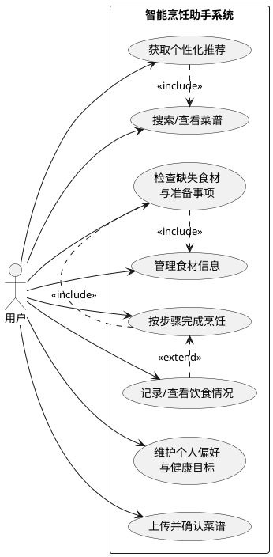

# 智能烹饪助手需求分析报告

## 1. 项目背景

随着生活节奏加快，越来越多的人选择在家自行烹饪，以节省开支并提升饮食健康水平。然而在实际生活中，个人烹饪仍然面临诸多问题：

1. 不知道做什么菜  
用户在面对已有食材时，往往缺乏灵感，不清楚可以制作哪些菜品。

2. 食材利用率低，容易浪费  
冰箱中的食材容易被遗忘或过期，用户缺乏有效的管理和提醒方式。

3. 烹饪流程复杂，新手难以掌握  
对于缺乏经验的用户来说，做菜步骤不清晰，容易出现操作失误。

4. 食材准备不完整  
用户常常在烹饪过程中才发现缺少关键材料，需要临时采购，影响效率和体验。

5. 健康饮食需求增加  
部分用户希望根据个人健康目标，如低脂、低盐、高蛋白、控糖等选择菜品，但缺乏便捷而持续的辅助工具。

6. 现有工具缺乏连续陪伴能力  
现有菜谱平台通常以信息展示为主，难以围绕“今天吃什么、需要准备什么、接下来怎么做、吃完后如何记录”这一完整过程提供持续支持。

因此，需要建设一套面向个人日常烹饪场景的智能烹饪助手，围绕菜品选择、食材准备、烹饪执行和饮食记录等环节提供连贯的辅助能力，帮助用户降低决策成本、提升烹饪成功率并减少食材浪费。

## 2. 项目目标

本项目从用户完成一次日常做饭的真实过程出发，拟实现以下目标：

1. 帮助用户更快决定“做什么”  
结合用户当前需求，为用户提供合适、可执行的菜品建议，减少反复选择带来的时间消耗。

2. 帮助用户提前明确“要准备什么”  
在开始烹饪前，让用户清楚了解所需食材、缺失食材和准备事项，避免中途发现条件不足。

3. 帮助用户顺利完成“怎么做”  
在烹饪过程中提供清晰、连续的步骤指导与关键提醒，降低出错率，提升新手完成度。

4. 帮助用户形成长期可用的个人饮食辅助工具  
支持用户维护个人偏好、收藏常做菜谱、记录饮食情况，使系统能够越来越贴近用户的实际习惯。

## 3. 核心使用场景与用户任务

本系统面向的是同一类核心用户：有日常做饭需求、希望获得更高效烹饪辅助的个人用户。相比分析不同人群类型，本项目更适合从用户在真实生活中的核心任务出发描述需求。

### 3.1 今天不知道吃什么

用户打开系统后，希望直接表达“今天吃什么比较合适”“我冰箱里有鸡蛋和番茄能做什么”等问题，并获得贴近当前情况的菜品建议。

### 3.2 已经想做某道菜，想知道要准备什么

用户可能已经有明确目标菜品，希望系统快速告知所需食材、当前缺少哪些材料、是否适合立即开始制作。

### 3.3 做饭过程中需要一步步指导

用户在厨房操作时，希望系统能提供简洁明确的分步说明、关键提醒和过程中的即时帮助，而不是让用户反复翻看长篇菜谱。

### 3.4 想管理自己的偏好和做饭记录

用户希望系统记住自己的口味偏好、忌口、过敏信息、健康目标、常用厨具和可接受的做饭时长，并在后续使用中持续体现这些偏好。同时，用户也希望查看自己的饮食记录、收藏和做饭历史。

### 3.5 想沉淀和补充自己的菜谱内容

用户除了使用现有菜谱外，也希望能够上传或整理自己的菜谱内容，让系统帮助形成规范的菜谱信息，并在后续继续使用。

## 4. 功能性需求

### 4.1 账号与个人信息管理

系统应支持用户完成基本账号使用和个性化信息维护，包括：

- 注册、登录和退出系统
- 查看和修改个人基础信息
- 设置并更新口味偏好、忌口和过敏信息
- 设置并更新健康目标，如减脂、增肌、控糖、清淡饮食等
- 设置并更新做饭熟练度、常用厨具和可接受做饭时长
- 保存用户的收藏、历史记录和常用偏好，供后续使用

### 4.2 菜谱获取与菜品选择

系统应支持用户以较低成本找到适合当下需求的菜品，包括：

- 浏览系统中的菜谱内容
- 按名称、口味、食材、场景等条件搜索或筛选菜谱
- 根据用户已有食材、口味偏好、健康目标、可用厨具和时间要求推荐菜品
- 为用户展示推荐结果，并支持查看菜谱详情
- 支持用户收藏感兴趣的菜谱
- 支持用户从菜谱页或对话中直接确定目标菜品，并进入后续准备与烹饪环节

### 4.3 食材管理与准备辅助

系统应帮助用户了解“家里有什么”和“做这道菜还差什么”，包括：

- 记录家中食材的名称、数量、单位、位置等基本信息
- 查看、修改和删除已有食材信息
- 在选择菜谱后，自动比对现有食材与菜谱所需食材
- 生成缺失食材或待补充材料清单
- 提示用户开始前需要确认的准备事项
- 当用户未提前维护完整食材清单时，仍可通过临时补充信息完成食材检查

### 4.4 烹饪过程辅助

系统应在用户实际下厨时提供连续指导，包括：

- 按步骤展示烹饪流程
- 让用户清楚看到当前步骤、下一步和关键注意事项
- 在需要等待、计时或容易出错的环节提供提醒
- 支持用户在烹饪过程中查看所需用量、操作说明和补充提示
- 支持用户根据实际进展继续、返回或重新查看步骤

### 4.5 对话式交互支持

系统应支持更自然、更贴近日常表达的交互方式，包括：

- 用户可通过自然语言表达需求，如“我想吃清淡一点的”“冰箱里有鸡胸肉还能做什么”
- 系统能够围绕当前做饭任务持续对话，而不是只返回一次性结果
- 在菜品选择、食材准备、烹饪执行、完成记录等不同任务阶段，系统都能继续理解用户当前意图
- 用户可通过文字和图片输入信息，系统应能据此继续完成相关任务

### 4.6 菜谱内容沉淀与上传

系统应支持用户沉淀和补充菜谱内容，包括：

- 查看菜谱详情中的食材、步骤和基础说明
- 上传自己的菜谱信息
- 支持用户通过图片、文字或两者结合的方式补充菜谱内容
- 对用户上传内容形成可确认、可修改的菜谱草稿
- 经用户确认后保存为可再次使用的菜谱内容

### 4.7 饮食记录与健康查看

系统应支持用户在完成做饭后查看和沉淀饮食信息，包括：

- 记录一次做饭或用餐结果
- 查看今日饮食情况和累计饮食情况
- 查看历史做饭记录和用餐记录
- 展示与饮食相关的基础营养信息
- 支持用户对菜品进行简单反馈，如喜欢程度、饱腹感等

## 5. 智能性需求

本项目的核心价值之一在于“智能辅助”而不仅仅是“信息展示”。系统应具备以下智能性能力：

### 5.1 个性化推荐能力

系统应能够综合用户偏好、健康目标、已有食材、时间要求、厨具条件和历史使用情况，为用户推荐更贴近当前情境的菜品，而不是提供完全通用的结果。

### 5.2 上下文理解能力

系统应能够理解用户在连续对话中的上下文信息。例如，用户已经表达了“想做清淡一点的晚饭”，后续再说“那就换个更快的”，系统应能结合前文继续理解，而非重新开始。

### 5.3 分阶段辅助能力

系统应能够根据用户当前所处任务阶段提供不同类型的帮助。例如，在选择菜时更强调推荐和比较，在准备阶段更强调缺失食材检查，在烹饪阶段更强调步骤指导和即时提醒。

### 5.4 长期偏好学习能力

系统应能够在长期使用中逐步贴近用户习惯，识别用户更常接受的口味、菜品类型、做饭场景和饮食倾向，从而不断提升推荐的相关性和实用性。

### 5.5 多模态理解能力

系统应支持对图片和文字信息的综合理解。例如，用户上传一张菜谱截图或一道菜的图片时，系统应能辅助提取相关内容，减少用户重复录入的负担。

### 5.6 结果解释与替代建议能力

系统在给出推荐、判断缺失食材或提示不适合某道菜时，应尽量向用户说明原因，并在条件不足时提供可替代方案，而不是只给出单一结论。

## 6. 性能与使用便利性需求

### 6.1 性能需求

- 普通页面和常规信息查询应保持较快响应，通常不超过 3 秒
- 推荐结果、食材检查和菜谱生成类操作应在可接受时间内完成，通常不超过 5 秒
- 在正常使用条件下，系统应支持多名用户同时访问而不出现明显卡顿或频繁失败

### 6.2 使用便利性需求

- 主要任务应尽量在较少步骤内完成，例如添加食材、查看推荐、开始烹饪等
- 信息展示应清晰易懂，尤其是食材名称、数量、缺失提示和步骤说明
- 用户中断操作后再次进入时，应能较方便地继续当前任务
- 系统应同时适配 PC 和移动端浏览器，方便用户在厨房、宿舍或居家环境中使用

### 6.3 可靠性需求

- 系统应保持稳定运行，不应频繁出现崩溃、无响应或关键流程中断
- 用户的偏好、收藏、菜谱、食材和记录等数据应被正确保存
- 对用户上传或生成的重要内容，应在确认后再正式保存，减少误操作带来的影响

### 6.4 安全与隐私需求

- 系统应保护用户账号和个人数据，避免未经授权的访问
- 用户的饮食偏好、健康目标和历史记录等信息应得到妥善保护
- 用户应能够对自己的核心信息进行查看、修改和必要的删除

## 7. 用户用例

### 7.1 参与者

本系统的主要参与者为用户。用户通过系统完成菜品选择、食材准备、烹饪指导、菜谱沉淀和饮食记录等任务。

### 7.2 核心用例

用户与系统之间的核心交互主要包括：

- 维护个人偏好与健康目标
- 获取个性化菜品推荐
- 搜索和查看菜谱
- 管理家中食材
- 检查缺失食材并确认准备事项
- 按步骤完成烹饪
- 上传并确认菜谱内容
- 记录和查看饮食情况

### 7.3 Use Case 图

以下内容可作为课程文档中的 Use Case 图描述基础：

## 8. 总结

本文档从用户完成一次日常做饭的实际过程出发，对智能烹饪助手需要实现的内容进行了整理。文档重点围绕用户在“决定做什么、准备什么、如何完成、如何沉淀”这一连续链路中的真实需求，提出了功能性需求、智能性需求、性能需求和使用便利性需求，并补充了系统的核心用户用例。该文档可作为后续概要设计、详细设计和系统实现的需求依据。
