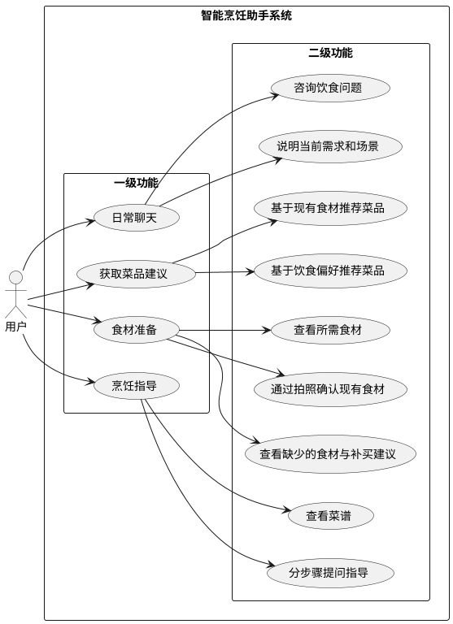

# 智能烹饪助手需求分析报告

## 1. 项目背景

在日常生活中，很多人并不是不愿意做饭，而是经常卡在“从想吃饭到真正把饭做出来”的一整段过程里。常见的问题并不只是不知道菜谱怎么写，而是：

- 一时想不到吃什么，做决定很耗神
- 想到了某道菜，却不确定家里现有食材够不够
- 即使知道缺什么，也不知道应该补买哪些东西、能不能替代
- 真正开始下厨后，又会在步骤、顺序、火候和时间上不断犹豫
- 做饭过程中情况变化很多，用户希望有人能根据当前上下文继续给建议

现有很多产品更像“菜谱展示工具”，擅长给出固定内容，却难以像一个会沟通、会理解场景的助手一样，陪用户完成从“今天吃什么”到“最后怎么做”的整段任务。

因此，本项目希望构建一个从用户真实生活场景出发的智能烹饪助手，让用户可以通过自然交流，把“决定吃什么、确认要准备什么、判断食材是否齐全、缺少时如何补齐、最后如何完成烹饪”串成一条更顺畅的体验链路。

## 2. 项目目标

本项目的目标不是单纯提供菜谱信息，而是帮助用户更轻松地完成一次做饭任务。具体目标包括：

- 帮助用户更快决定“今天吃什么”，减少反复纠结的时间成本
- 帮助用户在做饭前明确“这道菜需要准备什么”，降低临时发现条件不足的情况
- 帮助用户通过图片识别等更自然的方式确认现有食材情况，减少手动描述负担
- 帮助用户在缺少食材时获得清晰的补买建议，而不是停留在“材料不足”这一结论
- 帮助用户在烹饪过程中获得可跟随、可追问、可根据现场情况调整的指导
- 让系统能够适应不同用户、不同餐次、不同限制条件下的多样化做饭场景

## 3. 用户用例图

本系统只有一个核心参与者，即“用户”。用户与系统的交互不是零散的单点操作，而是围绕一次做饭任务逐步展开。为了让主线更清晰，用例图按照“一级功能 -> 二级功能”的方式组织，体现用户从日常交流、获取推荐，到食材准备、再到烹饪指导的递进关系。

上图体现了本系统的核心逻辑：用户先通过日常聊天表达当下需求，再获取合适的菜品建议；确定目标菜品后，进入食材准备阶段，确认所需食材、现有食材以及是否缺料；当准备条件满足后，再进入烹饪指导阶段。整个过程不是分裂的多个页面任务，而是一条逐步推进的用户任务链。

图中各层用例可进一步说明如下：

- 一级功能代表用户完成一次做饭任务所经历的主要阶段，是对整体体验的抽象概括。
- 二级功能代表每个阶段下用户最直接的操作目标，例如“基于现有食材推荐菜品”“通过拍照确认现有食材”“分步骤提问指导”等。

其中，最核心的主线用例是：

- 日常聊天并表达当前需求
- 获取菜品建议
- 进行食材准备
- 获得烹饪指导

此外，图中也体现了系统应支持的灵活分支：

- 用户可以从“我家里现在有什么食材”出发获取推荐
- 用户也可以从“我现在想吃什么口味、适合什么场景”出发获取推荐
- 在食材准备阶段，系统不仅要告诉用户缺什么，也要继续给出补买建议
- 在烹饪过程中，用户可以继续追问，让指导随着实际操作往下推进

## 4. 使用场景

### 4.1 下班后不知道吃什么

用户结束一天的工作或学习后，没有明确想法，只知道自己想尽快吃上一顿合适的晚饭。这时，用户通常会先说出一些模糊需求，例如“今天有点累，想吃简单一点的”“晚上想吃清淡一点”“家里好像还有几个鸡蛋”。

在这个场景下，用户希望系统能把以下需求串起来：

- 理解当前餐次、口味倾向和做饭意愿
- 结合现有食材、偏好和场景给出几个合适的选择
- 帮助用户比较不同选择之间的差异
- 让用户尽快确认要做哪一道菜

### 4.2 已经想好吃什么，但不确定能不能做

用户可能已经明确想做某道菜，但不确定需要准备哪些东西，也不确定家里现有条件是否足够。例如用户会说“我想做西红柿炒鸡蛋，家里现在这些东西够吗？”

在这个场景下，用户希望系统能把以下需求串起来：

- 明确展示这道菜通常需要哪些食材和准备事项
- 通过用户描述或拍照，识别当前已有的食材情况
- 帮助用户判断哪些已经具备，哪些还缺少
- 在开始做饭前给出一个明确结论：现在能不能开做

### 4.3 做饭前发现缺料，需要快速补齐

用户在准备阶段发现某些关键食材不足，但不想因为“缺一点东西”就完全中断计划。此时用户需要的不是一句“食材不够”，而是能继续推进的建议。

在这个场景下，用户希望系统能把以下需求串起来：

- 列出当前缺少的关键食材
- 说明每种食材在这道菜里的作用
- 提示哪些必须购买，哪些可以替代
- 帮助用户判断是继续购买、先换做别的菜，还是调整做法

### 4.4 打开冰箱或摆出台面后，希望系统帮忙识别

很多用户并不想逐条输入“我家里现在有什么”，更自然的做法是直接拍一张冰箱、购物袋或台面照片，让系统帮忙看一眼。这样能明显减少表达成本，也更接近日常使用方式。

在这个场景下，用户希望系统能把以下需求串起来：

- 通过图片大致识别当前可用食材
- 结合目标菜品判断这些食材是否足够
- 识别出还缺哪些关键项目
- 如果不够，继续衔接到补买或换菜建议

### 4.5 做饭过程中需要一步一步陪着做

用户开始下厨后，真正关心的是“下一步做什么、现在这样对不对、出了变化怎么办”。用户不希望看一大段静态菜谱自己消化，而是希望系统像身边有人陪着一样，在关键时刻给出明确指引。

在这个场景下，用户希望系统能把以下需求串起来：

- 按顺序展示当前应该做的步骤
- 在时间、火候、顺序等关键点给出提醒
- 允许用户随时提问，例如“现在是不是该翻面了”
- 当食材状态、锅里情况或缺料情况发生变化时，继续调整建议

## 5. 功能性需求

### 5.1 围绕做饭任务的对话表达

- 用户应能够用自然语言表达自己当前的饮食想法、限制条件和场景需求
- 用户不需要一次性把信息说全，系统应支持用户边聊边逐步补充条件
- 用户应能够在同一轮做饭任务中持续推进，而不是频繁切换到完全不同的操作模式

### 5.2 菜品选择支持

- 系统应能够围绕“今天吃什么”给出合适的菜品建议
- 系统应支持基于现有食材、口味偏好、餐次、人数、时间安排等因素推荐菜品
- 用户应能够在多个候选菜品之间进行比较，并确认最终要做的菜

### 5.3 准备事项确认

- 在用户确定目标菜品后，系统应能帮助用户明确需要准备哪些食材和前置事项
- 系统应支持用户通过文字描述或图片方式说明自己当前已有的食材
- 系统应能帮助用户判断当前食材是否足以支持开始烹饪

### 5.4 缺失食材处理

- 当食材不足时，系统应能明确指出还缺哪些关键项目
- 系统应能帮助用户理解缺失食材对这道菜的影响
- 系统应能为用户提供补买建议或替代建议，帮助用户继续推进任务

### 5.5 烹饪过程指导

- 系统应能够为目标菜品提供清晰的分步骤指导
- 系统应支持用户在烹饪过程中随时提出补充问题
- 当用户现场情况变化时，系统应能够继续给出可执行的后续建议

## 6. 智能性需求

- 系统应能够结合用户当前输入、已有偏好和场景信息，给出更贴近当下情境的建议，而不是只返回通用答案
- 系统应能够理解连续对话中的上下文，避免用户每一步都重复说明前提
- 系统应能够根据用户当前处于“选菜、备料、补买、烹饪”中的哪一阶段，调整回应重点
- 系统应能够同时理解文字与图片输入，降低用户描述现状的难度
- 系统在给出建议时，应尽量说明原因，并在条件不足时提供替代方向
- 系统应具备一定的场景适应能力，在不同餐次、不同限制条件下保持建议合理

## 7. 性能需求

- 用户发起普通咨询时，系统应在较短时间内给出反馈，避免明显等待感
- 菜品推荐、食材判断、图片识别和步骤指导等关键任务应在可接受时间内完成，保证用户可以顺畅推进做饭流程
- 在一次任务连续进行的过程中，系统应保持响应稳定，不因阶段切换而频繁中断
- 在常见使用条件下，系统应能支持多名用户同时使用而不出现明显卡顿

## 8. 使用便利性需求

- 用户应能够以较少步骤完成一次从“决定吃什么”到“开始做饭”的任务
- 信息表达应尽量贴近日常语言，降低用户学习成本
- 对关键结果的呈现应清晰直观，尤其是候选菜品、所需食材、缺少项目和烹饪步骤
- 系统应兼顾移动端与 PC 端使用，方便用户在厨房、宿舍、家中客厅等不同环境下操作
- 用户在中途打断后再次返回时，应能够较容易接上当前任务
- 图片输入、分步骤指导等能力应尽量减少用户反复手动整理信息的负担
