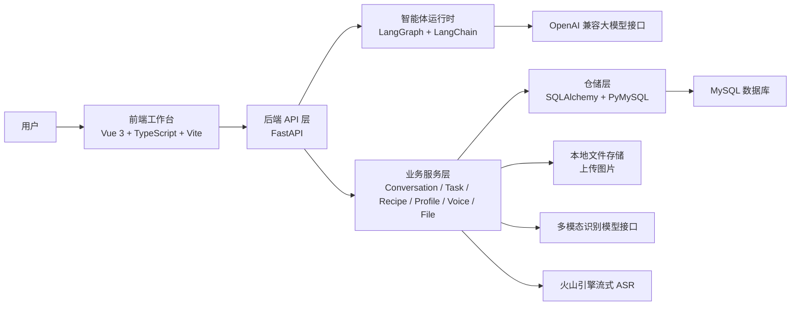
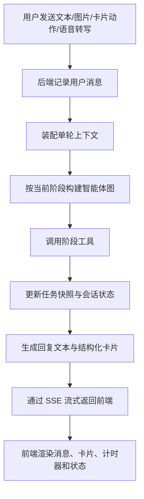
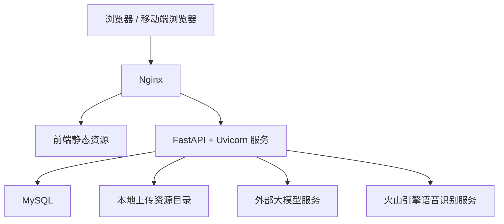

# ChefMate 系统实现报告

## 1. 系统概述

ChefMate 是一个面向日常家庭烹饪场景的智能体 Web 应用。系统以“任务驱动”的方式组织交互过程，围绕一次做饭任务，连续完成菜品推荐、菜谱确认、备料检查、烹饪步骤指导、语音辅助和历史对话管理等功能。

本项目采用前后端分离实现。其中，前端负责工作台界面、消息卡片渲染、语音采集、计时器与页面交互；后端负责用户认证、会话管理、任务状态机、智能体编排、菜谱检索、图片识别、语音识别接入与数据持久化。

## 2. 系统开发使用的技术架构

### 2.1 总体技术架构

系统采用“Vue 3 前端工作台 + FastAPI 后端服务 + LangGraph 智能体运行时 + MySQL 数据持久化 + 外部模型服务”的总体架构。

### 2.2 智能体实现架构

ChefMate 的智能体并非单纯聊天机器人，而是带有显式任务阶段控制的多阶段代理系统。后端围绕一次用户回合构建运行上下文，并通过图编排与工具调用推进真实状态。

#### 2.2.1 智能体分层

| 层次 | 主要模块 | 实现说明 |
| --- | --- | --- |
| 运行上下文层 | `AgentTurnContext` | 汇总用户画像、当前会话、当前任务快照、最近消息、历史任务、附件、前端卡片状态 |
| 阶段控制层 | `ConversationStage`、`TaskService` | 将任务阶段统一为 `idea -> planning -> shopping -> cooking -> idea` |
| 图编排层 | `build_agent_graph` | 基于 `LangGraph create_react_agent` 构建单轮执行图 |
| 工具层 | `build_stage_tools` | 按阶段提供推荐、备料、烹饪、回滚、取消、记忆更新、图像识别等工具 |
| 业务服务层 | `conversation_service`、`recipe_service`、`profile_service` 等 | 负责真实读写会话、任务、图片、用户画像和菜谱数据 |
| 输出协议层 | 卡片构造器、SSE 流 | 将文本回复、状态变化与结构化卡片统一返回前端 |

#### 2.2.2 智能体工作流程

#### 2.2.3 智能体阶段能力

| 任务阶段 | 对外显示 | 主要目标 | 典型工具能力 |
| --- | --- | --- | --- |
| `idea` | 闲聊 / 无任务 | 接收需求、进入推荐流程 | 开启推荐任务、读取用户长期记忆 |
| `planning` | 推荐中 | 检索候选菜、展示详情、确定目标菜谱 | 推荐菜谱、识别图片食材、创建或覆盖任务菜谱、推进到备料 |
| `shopping` | 备料中 | 维护食材准备状态，确认是否具备开做条件 | 更新备料状态、展示备料卡、推进到烹饪、回滚或取消 |
| `cooking` | 烹饪中 | 维护步骤推进、回答过程问题、完成任务 | 更新步骤状态、展示烹饪卡、完成任务、回滚或取消 |

#### 2.2.4 智能体实现特点

- 采用任务快照机制保存本次做饭任务的动态菜谱，不直接修改原始菜谱库。
- 阶段流转必须通过后端工具与任务服务完成，避免前端显示状态与后端真实状态不一致。
- 前端卡片状态会回传至后端，用于理解“这一步”“这些都备齐了”等上下文指代。
- 输出支持文本与结构化卡片混合返回，便于用户在自然语言和界面操作之间切换。

### 2.3 前端开发技术

| 类别 | 技术选型 | 用途 |
| --- | --- | --- |
| 前端框架 | Vue 3 | 构建组件化界面与响应式交互 |
| 构建工具 | Vite | 本地开发与生产构建 |
| 语言 | TypeScript | 提升前端类型安全与接口一致性 |
| 路由 | Vue Router | 管理登录页、聊天页、菜谱页等路由入口 |
| 状态组织 | Composition API + 本地会话状态模块 | 管理工作台状态、登录态、计时器和语音输入状态 |
| 网络通信 | Fetch API + EventSource 风格 SSE 解析 + WebSocket | 对接 REST、流式回复和语音流 |
| 语音采集 | Web Audio API + AudioWorklet | 浏览器侧 PCM 音频采集、重采样与分块发送 |

前端实现上，系统虽然保留了多个路由入口，但核心页面组织采用统一工作台模式，由 `App.vue` 统筹认证页、聊天工作台、菜谱页、设置弹窗与首次引导流程，从而保证会话状态、计时器状态和侧边栏状态的连续性。

### 2.4 后端开发技术

| 类别 | 技术选型 | 用途 |
| --- | --- | --- |
| Web 框架 | FastAPI | 提供 REST API、SSE 和 WebSocket 服务 |
| 配置管理 | Pydantic Settings | 统一环境变量与配置项 |
| 数据库访问 | SQLAlchemy + PyMySQL | MySQL 连接与 SQL 执行 |
| 智能体编排 | LangChain + LangGraph | 单轮智能体执行图、工具调用与模型适配 |
| 大模型接入 | OpenAI 兼容 SDK | 对接文本模型与多模态模型接口 |
| 异步网络 | aiohttp | 语音识别 WebSocket 通信 |
| 文件上传 | python-multipart | 接收图片上传 |
| 密码安全 | PBKDF2-HMAC-SHA256 | 用户密码加密存储 |

### 2.5 前后端接口与通信方式

系统采用多协议协同通信。

| 通信方式 | 主要用途 | 典型接口 |
| --- | --- | --- |
| REST | 登录注册、用户画像、菜谱检索、图片上传、会话创建 | `/api/auth/*`、`/api/profile`、`/api/recipes`、`/api/files/images` |
| SSE | 智能体流式回复 | `/api/conversations/{conversation_id}/messages/stream` |
| WebSocket | 语音流式识别 | `/api/voice/stream` |

后端当前提供的主要接口模块如下：

| 模块 | 主要职责 |
| --- | --- |
| 认证接口 | 注册、登录、获取当前用户、退出登录 |
| 画像接口 | 获取用户档案、更新偏好、获取标签目录 |
| 会话接口 | 会话列表、会话详情、创建会话、发送消息、流式消息 |
| 菜谱接口 | 菜谱列表、关键词搜索、详情查询 |
| 文件接口 | 图片上传 |
| 语音接口 | 唤醒词检测、流式转写 |

### 2.6 数据持久化设计

系统当前使用 MySQL 保存核心业务数据，并以本地文件目录保存上传图片。

#### 2.6.1 主要数据表

| 数据表 | 作用 |
| --- | --- |
| `chefmate_user` | 用户基础信息与个性化设置 |
| `user_preference_tag` | 用户长期偏好标签 |
| `auth_session` | 登录会话与 token 管理 |
| `conversation` | 对话标题、阶段、摘要、当前任务引用 |
| `conversation_task` | 任务状态、动态菜谱快照、任务结果 |
| `conversation_message` | 对话消息正文、建议词与结构化卡片 |
| `conversation_message_attachment` | 消息与附件关联 |
| `uploaded_asset` | 上传图片元数据 |
| `recipe`、`recipe_ingredient`、`recipe_step`、`recipe_tag*` | 静态菜谱库与标签体系 |

#### 2.6.2 动态菜谱快照机制

系统将本次任务中的目标菜谱保存为 `conversation_task.recipe_snapshot_json`。该快照记录：

- 当前任务使用的菜名、配料、步骤和标签
- 食材备齐状态
- 步骤完成状态
- 当前焦点步骤
- 任务期间对菜谱进行的局部修改

这种设计使系统既能复用静态菜谱库进行推荐，又能在单次任务中安全维护动态执行状态。

## 3. 服务部署方案介绍

### 3.1 部署环境

本系统拟部署于云服务提供商虚拟机，部署规格如下：

| 项目 | 配置 |
| --- | --- |
| 计算资源 | 2 核 CPU / 2 GB 内存 |
| 部署形态 | 单台云服务器部署 |
| 操作系统 | Alibaba Cloud Linux 3.2104 U10 (OpenAnolis Edition) |
| 运行方式 | 前端静态资源 + 后端服务进程 + 本地 MySQL |

### 3.2 部署拓扑

考虑当前系统当前规模与资源配置，建议采用单机部署方案，将 Nginx、前端静态资源、FastAPI 服务、MySQL 与上传目录统一部署在同一台虚拟机中。

### 3.3 生产部署建议

#### 3.3.1 前端部署

- 在服务器上使用 Node.js 完成前端应用的依赖安装和生产构建。
- 通过 `npm run build` 生成 `dist` 静态文件。
- 使用 Nginx 托管静态资源，并将 `/api`、`/assets` 和语音相关路径反向代理到后端服务。

#### 3.3.2 后端部署

- 在服务器上创建 Python 虚拟环境，安装后端服务所需依赖。
- 通过 `uvicorn app.main:app --host 0.0.0.0 --port 8000` 启动 FastAPI 服务。
- 建议使用 `systemd` 管理后端进程，保证开机自启与异常重启。

#### 3.3.3 数据与存储部署

- 在同一台虚拟机中部署 MySQL 实例，数据库名可配置为 `chefmate`。
- 上传图片存储在服务器本地上传资源目录中，并由 FastAPI 以静态资源方式暴露。
- 对于当前阶段的实际使用需求，该方案足以满足部署与运行要求；若后续访问量增长，可进一步将图片迁移到对象存储，将数据库迁移到独立实例。

### 3.4 部署组件划分

| 组件 | 部署位置 | 作用 |
| --- | --- | --- |
| Nginx | 虚拟机本机 | 反向代理、静态资源分发、HTTPS 入口 |
| Frontend Dist | 虚拟机本机 | 用户界面静态资源 |
| FastAPI 服务 | 虚拟机本机 | 提供业务接口、流式消息、语音 WebSocket |
| MySQL | 虚拟机本机 | 持久化用户、对话、任务、菜谱等数据 |
| 上传目录 | 虚拟机本机磁盘 | 存放用户上传的图片 |

### 3.5 资源适配说明

针对 2 核 2 GB 的资源配置，建议采用轻量化部署策略：

- 前端使用静态构建发布，减少运行时资源占用。
- 后端采用异步 Web 服务，减少单机线程阻塞。
- Uvicorn 进程数以 1 个主进程或少量 worker 为宜，避免内存挤占。
- MySQL 与后端共机部署时应控制连接数与日志级别。
- 图片识别和文本推理优先走外部模型服务，本机不承担大规模模型推理负载。

## 4. 实际系统完整功能结构图

### 4.1 总体功能结构

```mermaid
graph TD
    A["ChefMate 智能烹饪系统"]

    A --> B["用户与账号管理"]
    A --> C["智能对话工作台"]
    A --> D["菜谱浏览与检索"]
    A --> E["用户画像与系统设置"]
    A --> F["系统支撑能力"]

    B --> B1["注册"]
    B --> B2["登录"]
    B --> B3["登录态管理"]

    C --> C1["历史会话列表"]
    C --> C2["新建对话"]
    C --> C3["智能推荐"]
    C --> C4["菜谱详情卡"]
    C --> C5["备料检查卡"]
    C --> C6["烹饪步骤卡"]
    C --> C7["图片上传识别"]
    C --> C8["语音输入与待命唤醒"]
    C --> C9["流式回复显示"]
    C --> C10["本地倒计时"]

    D --> D1["推荐菜谱展示"]
    D --> D2["关键词检索"]
    D --> D3["按菜名/食材/做法/口味搜索"]
    D --> D4["菜谱详情查看"]
    D --> D5["从菜谱发起对话"]

    E --> E1["首次使用引导"]
    E --> E2["长期偏好标签"]
    E --> E3["偏好文本档案"]
    E --> E4["自动更新记忆设置"]
    E --> E5["自动计时设置"]
    E --> E6["唤醒词设置"]
    E --> E7["账户信息维护"]

    F --> F1["任务状态管理"]
    F --> F2["会话摘要压缩"]
    F --> F3["结构化卡片协议"]
    F --> F4["图片文件管理"]
    F --> F5["语音识别接入"]
    F --> F6["数据库持久化"]
```

### 4.2 智能体业务主线

## 5. 各项功能的菜单页面、使用方法与效果说明

### 5.1 登录与注册

**菜单页面**

- 路由入口：`/auth/login`
- 路由入口：`/auth/register`

**页面功能**

- 完成账号注册与登录
- 对用户名、邮箱、密码进行前端与后端双重校验
- 登录成功后保存 token，并自动进入聊天工作台

**使用方法**

1. 首次使用时进入注册页，填写用户名、邮箱和密码。
2. 注册成功后系统自动写入本地登录态并跳转到聊天页。
3. 已有账号的用户可直接在登录页输入用户名和密码完成登录。

**实现效果说明**

- 页面采用双栏结构展示品牌信息与认证表单。
- 注册模式会实时提示用户名格式、密码强度和确认密码一致性。
- 已登录用户再次访问认证页时，会自动跳转到主工作台。

> 图 5-1 登录页面效果图（占位）
>
> 图 5-2 注册页面效果图（占位）

### 5.2 首次使用引导

**菜单页面**

- 触发方式：用户首次进入工作台后自动弹出

**页面功能**

- 引导用户完成昵称设置
- 选择长期记忆标签
- 填写做饭偏好文本
- 设置自动更新记忆、自动计时和语音唤醒偏好

**使用方法**

1. 登录后按向导逐步填写显示名称。
2. 选择口味、做法、场景、健康、时间和工具等长期偏好标签。
3. 根据个人习惯设置自动更新档案、自动计时与唤醒词选项。
4. 完成后系统将画像写入后端，并自动创建新对话。

**实现效果说明**

- 页面采用多步骤向导，左侧展示进度，右侧展示当前步骤内容。
- 偏好档案支持跳过，降低首次使用门槛。
- 完成后会关闭引导弹窗并进入主工作台。

> 图 5-3 首次使用引导弹窗效果图（占位）

### 5.3 聊天工作台与历史会话

**菜单页面**

- 主入口：`/chat`
- 侧边栏菜单：新建对话、历史会话列表、菜谱快捷入口、个人资料入口

**页面功能**

- 新建对话与恢复历史会话
- 展示当前会话标题、阶段、当前菜品和计时器状态
- 显示消息流、卡片、建议词和输入区

**使用方法**

1. 进入工作台后，可从左侧点击“开启一个新对话”创建新会话。
2. 点击历史对话可恢复之前的推荐、备料或烹饪过程。
3. 在底部输入框直接输入需求，也可点击建议词快速发起对话。

**实现效果说明**

- 侧边栏会显示每个会话当前处于“闲聊、推荐中、备料中、烹饪中”的哪一阶段。
- 如果某个会话正在计时，侧边栏会显示“正在倒计时”状态。
- 主区域消息支持流式刷新，用户可即时看到系统的思考与回复过程。

> 图 5-4 聊天工作台总览效果图（占位）
>
> 图 5-5 历史会话列表效果图（占位）

### 5.4 智能推荐功能

**菜单页面**

- 所属页面：聊天工作台
- 呈现方式：推荐结果卡

**页面功能**

- 根据用户输入的口味、时间、场景、食材等条件推荐候选菜谱
- 展示候选菜的名称、简介、难度、用时、份量和标签
- 提供“查看详情”和“想尝试”等结构化动作

**使用方法**

1. 在聊天框输入“今晚想吃点热乎的”“帮我推荐一道快手菜”等需求。
2. 系统返回推荐结果卡，展示 3 道候选菜。
3. 点击“查看详情”可查看菜谱详情卡；点击“想尝试”则会将该菜加入当前任务，进入后续流程。

**实现效果说明**

- 推荐结果卡嵌入消息流，不需要跳出聊天页。
- 推荐逻辑会综合用户长期偏好标签、关键词、食材和标签过滤条件。
- 结果卡与自然语言解释同时返回，兼顾交互灵活性与结构化浏览体验。

> 图 5-6 智能推荐结果卡效果图（占位）

### 5.5 图片上传与食材识别

**菜单页面**

- 所属页面：聊天工作台输入区
- 入口：输入区“+”按钮上传图片

**页面功能**

- 支持用户上传食材图片
- 后端保存图片并生成可访问链接
- 智能体在推荐阶段可调用图像识别能力识别图片中的食材种类

**使用方法**

1. 在输入区点击上传按钮，选择一张食材图片。
2. 图片上传成功后会在输入区显示预览。
3. 用户发送消息后，系统会结合图片附件判断是否需要识别食材并参与推荐。

**实现效果说明**

- 上传过程带有“上传中 / 已就绪 / 上传失败”状态反馈。
- 当前实现采用多模态模型识别路线，返回结构化食材名称列表。
- 图片识别结果会进一步参与菜谱推荐或备料判断。

> 图 5-7 图片上传与识别效果图（占位）

### 5.6 备料检查功能

**菜单页面**

- 所属页面：聊天工作台
- 呈现方式：备料检查卡

**页面功能**

- 展示目标菜谱的配料清单、数量、备注和准备状态
- 支持列表模式与闪卡模式
- 实时计算备料完成度
- 支持“这些都备齐了”按钮推进任务

**使用方法**

1. 选定菜谱后，系统自动进入备料阶段并展示备料检查卡。
2. 用户可以逐项勾选已备齐食材，或切换至闪卡模式逐条确认。
3. 全部必需食材备齐后，点击主按钮进入烹饪阶段。

**实现效果说明**

- 卡片会记录用户当前勾选状态和焦点项，并同步给后端用于理解上下文。
- 当用户说“这些都好了”“还差什么”时，系统会基于当前备料状态给出回答。
- 列表模式适合总览，闪卡模式适合边找食材边核对。

> 图 5-8 备料检查卡列表模式效果图（占位）
>
> 图 5-9 备料检查卡闪卡模式效果图（占位）

### 5.7 烹饪步骤指导与计时器

**菜单页面**

- 所属页面：聊天工作台
- 呈现方式：烹饪步骤卡 + 顶部计时器区域

**页面功能**

- 展示当前步骤、总步骤数和每一步说明
- 支持列表模式与闪卡模式
- 支持手动启动计时器
- 可根据个人设置自动启动带时长的步骤计时

**使用方法**

1. 进入烹饪阶段后，系统自动展示烹饪步骤卡。
2. 用户可点击列表中的任一步骤查看详情，或在闪卡模式下逐步推进。
3. 对于带时间的步骤，可点击计时按钮；如果已开启自动计时，则系统会自动启动。
4. 计时器运行期间，可在页面顶部暂停、继续、重置或取消。

**实现效果说明**

- 步骤卡会突出当前步骤，并显示预计时长与备注。
- 计时结束后会提示用户，并将界面聚焦回对应对话。
- 该设计适合厨房场景中的“边做边看”使用方式。

> 图 5-10 烹饪步骤卡效果图（占位）
>
> 图 5-11 计时器运行效果图（占位）

### 5.8 语音输入与待命唤醒

**菜单页面**

- 所属页面：聊天工作台输入区
- 入口：输入区“语音”按钮与“待命”按钮

**页面功能**

- 浏览器侧录音与实时音频分块
- 直接语音输入
- 待命模式下通过“小厨小厨”唤醒正式录音
- 后端使用流式 ASR 返回转写结果

**使用方法**

1. 点击“语音”按钮可直接开始录音，再次点击停止。
2. 若已开启唤醒功能，可点击“待命”进入等待状态。
3. 在待命状态下说出“小厨小厨”，系统识别唤醒词后进入正式语音输入。
4. 语音识别结束后，转写文本会自动作为消息发送到当前对话。

**实现效果说明**

- 前端使用 Web Audio API 对音频做采样、重采样和分块处理。
- 后端通过 WebSocket 与语音识别服务通信，返回 `partial` 和 `final` 结果。
- 该功能适合双手忙碌、不便打字的烹饪过程。

> 图 5-12 语音输入效果图（占位）
>
> 图 5-13 待命唤醒效果图（占位）

### 5.9 菜谱浏览与搜索

**菜单页面**

- 路由入口：`/recipes`
- 入口方式：侧边栏“菜谱”菜单

**页面功能**

- 显示推荐菜谱和最近尝试菜谱
- 支持关键词搜索
- 支持按菜名、食材、做法、口味组合检索

**使用方法**

1. 从左侧菜单进入菜谱页。
2. 在搜索框中输入关键词，并按需选择搜索范围。
3. 点击“搜索菜谱”查看结果，点击“恢复推荐”可回到默认推荐列表。
4. 点击任一菜谱卡片可进入详情页。

**实现效果说明**

- 默认状态下，系统会结合用户长期偏好返回推荐菜谱。
- 页面上方还会展示最近尝试过的菜谱，便于快速回访。
- 搜索结果支持多字段组合，更适合手动检索和浏览。

> 图 5-14 菜谱浏览页效果图（占位）

### 5.10 菜谱详情与一键开启对话

**菜单页面**

- 路由入口：`/recipes/:recipeId`

**页面功能**

- 展示菜谱描述、难度、用时、份量、标签
- 展示完整原料清单、补充说明和步骤列表
- 支持从当前菜谱直接开启专属对话

**使用方法**

1. 在菜谱浏览页中点击某一道菜进入详情页。
2. 浏览该菜谱的原料、步骤和补充说明。
3. 点击“开启对话”后，系统会为该菜直接创建任务并进入备料阶段。

**实现效果说明**

- 菜谱详情页既可独立浏览，也可作为智能体对话的入口。
- 通过“先看详情再开始做”的方式，降低用户决策成本。
- 后端创建专属会话后，会自动带上该菜的动态任务快照。

> 图 5-15 菜谱详情页效果图（占位）

### 5.11 个人设置与账户管理

**菜单页面**

- 入口：侧边栏底部个人资料卡
- 呈现方式：右侧弹出设置面板

**页面功能**

- 维护长期记忆标签和偏好文本
- 设置自动更新档案、自动计时和唤醒词开关
- 修改显示名称与邮箱
- 退出登录

**使用方法**

1. 点击侧边栏底部头像卡进入设置面板。
2. 在“档案”页签中维护标签和偏好文本。
3. 在“设置”页签中调整自动更新、自动计时与唤醒词设置。
4. 在“账户”页签中修改显示名称、邮箱或退出登录。

**实现效果说明**

- 设置面板采用多页签结构，便于区分档案、开关设置和账户信息。
- 用户长期偏好修改后，会直接影响菜谱推荐结果。
- 退出登录后，系统会清理本地状态并返回认证页。

> 图 5-16 个人设置面板效果图（占位）
>
> 图 5-17 账户管理页签效果图（占位）

## 6. 系统实现总结

ChefMate 已实现从用户登录、首次建档、智能推荐、图片识别、备料检查、烹饪步骤指导、语音输入到菜谱浏览和个人设置的完整闭环。系统的核心实现价值在于：

- 以前后端分离方式构建了可落地的智能体 Web 应用；
- 以任务阶段和工具调用实现了可控的多阶段烹饪智能体；
- 通过结构化卡片将智能体结果转化为可操作的页面交互；
- 在 2 核 2 GB 云服务器条件下，能够采用轻量级单机方案完成部署与运行。

从工程实现角度看，该系统已经形成较完整的实现基础，后续可继续在模型能力、数据库拆分、对象存储、监控告警和高并发部署方面扩展。
