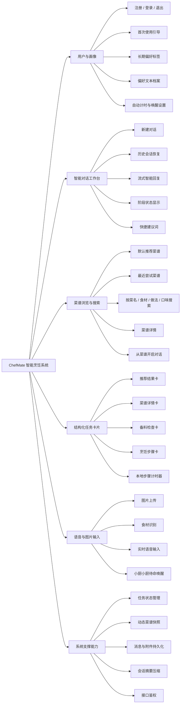
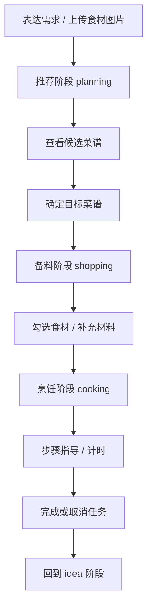
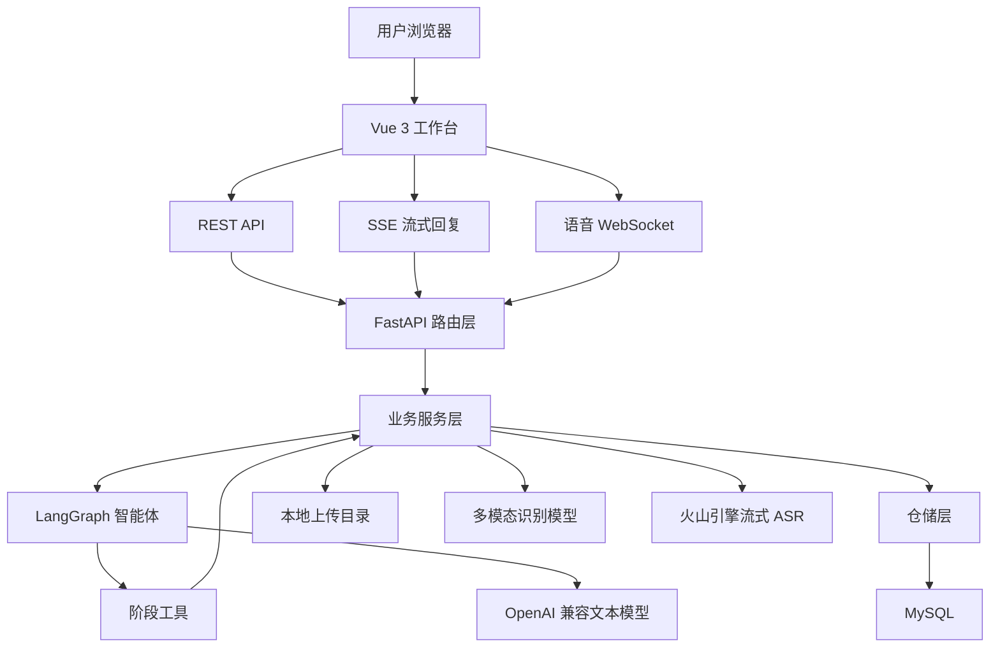
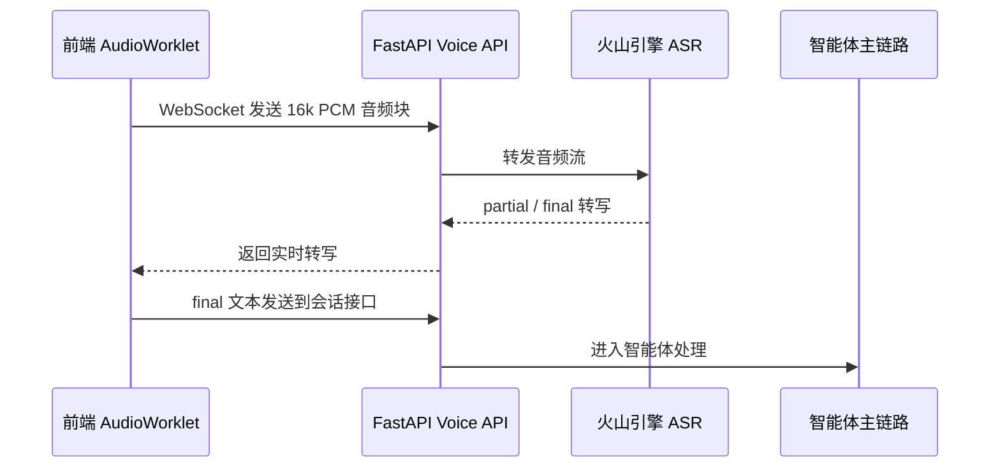
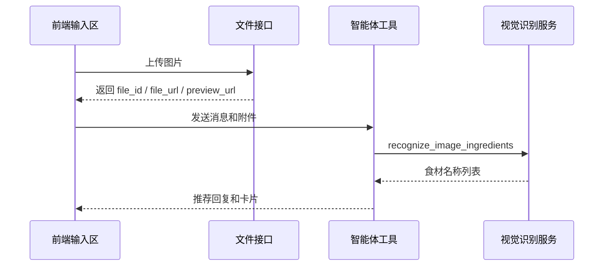

# ChefMate 系统实现报告

## 1. 项目背景与需求

ChefMate 是一个面向家庭烹饪场景的智能烹饪助手。用户在真实做饭过程中往往不是单次查询菜谱，而是连续经历“今天吃什么、怎么选菜、材料够不够、下一步怎么做、需要计时多久”等多个环节。因此，本项目没有把系统实现为单纯的菜谱查询站点，而是围绕一次完整做饭任务，设计成“对话式智能体 + 结构化操作卡片 + 菜谱库 + 语音/图片输入”的 Web 应用。

系统需要解决的核心需求如下：

| 需求类别 | 具体需求 | 当前实现 |
| --- | --- | --- |
| 个性化推荐 | 根据口味、时间、食材、厨具、健康偏好推荐菜谱 | 用户画像标签、偏好文本、菜谱标签检索、智能体工具调用 |
| 任务连续推进 | 从推荐进入备料，再进入烹饪指导，状态不能丢失 | `idea -> planning -> shopping -> cooking` 阶段状态机 |
| 厨房场景交互 | 支持不方便打字时的语音输入，支持上传食材图片 | Web Audio + WebSocket ASR；图片上传 + 多模态识别 |
| 可操作界面 | 智能体输出不只是文字，还要能勾选、查看、推进步骤 | 推荐卡、菜谱详情卡、备料卡、烹饪步骤卡 |
| 历史记录与偏好 | 保存对话、任务、历史菜谱和用户长期偏好 | MySQL 持久化用户、会话、任务、消息、菜谱 |
| 工程可部署 | 前后端分离，后端接口清晰，能在普通云服务器运行 | Vue 3 + FastAPI + MySQL + 外部模型服务 |

从产品目标看，ChefMate 更接近“厨房里的任务协作助手”：它既能聊天推荐，也能把推荐结果变成可执行的备料清单和步骤指导。

## 2. 系统功能、框架结构

### 2.1 总体功能结构

系统主要功能分为账号画像、智能对话、菜谱库、语音图片输入、任务卡片和系统支撑六类。



### 2.2 业务主流程

ChefMate 的主流程围绕一次做饭任务展开。用户可以从聊天页发起需求，也可以从菜谱详情页直接开启任务。



阶段设计不是简单的前端页面切换，而是后端任务状态、智能体可用工具、结构化卡片和前端展示状态共同协作的结果。

### 2.3 前后端框架结构

项目采用前后端分离结构，核心目录如下：

| 目录 | 主要内容 | 说明 |
| --- | --- | --- |
| `frontend/src` | Vue 3 前端应用 | 工作台、认证页、菜谱页、卡片组件、语音输入组合式函数 |
| `backend/app/api` | FastAPI 路由层 | 认证、画像、会话、菜谱、文件、语音接口 |
| `backend/app/services` | 业务服务层 | 会话、任务、菜谱、画像、文件、语音、视觉识别 |
| `backend/app/agent` | 智能体层 | LangGraph 图构建、Prompt、工具、单轮上下文 |
| `backend/app/repositories` | 仓储层 | SQLAlchemy/PyMySQL 数据访问封装 |
| `backend/app/domain` | 领域模型 | 阶段枚举、卡片结构、任务快照模型 |
| `data/database` | 数据库脚本 | 菜谱库表、业务表、语音设置迁移 |
| `ml/vision` | 视觉模型训练 | FoodSeg103 转换、YOLO 训练、验证、导出、推理脚本 |

总体框架如下：



## 3. 系统核心技术与方法

### 3.1 智能方法：阶段型烹饪 Agent

ChefMate 的核心智能方法是“带显式状态约束的多阶段烹饪智能体”。它不是让大模型自由聊天，而是让模型在后端状态机限制下调用工具，推动真实任务变化。

#### 3.1.1 单轮上下文建模

后端在每次用户发送消息时构造 `AgentTurnContext`，其中包含：

- 用户画像：昵称、偏好文本、长期标签、最近完成任务；
- 会话状态：标题、当前阶段、摘要、最近消息窗口；
- 当前任务：任务 ID、任务阶段、源菜谱 ID、动态菜谱快照；
- 本轮输入：文本、卡片动作、图片附件；
- 前端卡片状态：备料勾选、当前步骤、闪卡焦点等；
- 输出缓冲：本轮要返回的卡片类型、卡片内容、当前菜名。

这种上下文设计让智能体能理解“这些都备齐了”“下一步是什么”“看这张图能做什么”这类强依赖状态的表达。

#### 3.1.2 阶段与工具约束

系统定义了 4 个业务阶段：

| 阶段 | 前端显示 | 目标 | 主要工具 |
| --- | --- | --- | --- |
| `idea` | 闲聊 | 接收需求、读取记忆、开启推荐任务 | `get_user_memory`、`start_recommendation_task` |
| `planning` | 推荐中 | 推荐菜谱、查看详情、确定任务菜谱 | `recommend_recipes`、`show_recipe_detail_card`、`create_or_update_task_recipe`、`recognize_image_ingredients` |
| `shopping` | 备料中 | 展示清单、更新食材状态、判断能否进入烹饪 | `show_pantry_card`、`update_task_recipe_for_preparation`、`advance_to_cooking` |
| `cooking` | 烹饪中 | 展示步骤、推进步骤、完成或取消任务 | `show_cooking_card`、`update_task_recipe_for_cooking`、`complete_cooking_task` |

后端工具内部会检查当前阶段。例如备料未完成时，`advance_to_cooking` 会通过 `ensure_can_enter_cooking` 校验动态菜谱快照，避免前端误点或模型误判导致任务直接跳入烹饪。

#### 3.1.3 动态菜谱快照

系统没有直接修改静态菜谱库，而是在 `conversation_task.recipe_snapshot_json` 中保存本次任务的动态副本。该快照包含：

- 菜名、描述、难度、预计时间、份量；
- 标签、食材、步骤；
- 食材是否备齐；
- 步骤当前状态；
- 当前任务中对菜谱的局部调整。

这样既能复用数据库中的标准菜谱，又能在一次做饭任务中安全维护“我已经备好哪些材料”“当前做到第几步”等临时状态。

### 3.2 模型训练与使用

系统当前涉及两类模型能力：对话任务推进模型和食材图像识别模型。

#### 3.2.1 对话模型使用

对话智能体通过 OpenAI 兼容接口调用文本模型，默认配置项包括：

| 配置项 | 当前默认值 | 用途 |
| --- | --- | --- |
| `CHEFMATE_LLM_BASE_URL` | `https://api.openai.com/v1` | 文本模型 API 地址 |
| `CHEFMATE_LLM_MODEL` | `gpt-4.1-mini` | 智能体主模型 |
| `CHEFMATE_LLM_TEMPERATURE` | `0.25` | 控制输出稳定性 |
| `CHEFMATE_LLM_TIMEOUT_SECONDS` | `120` | 模型调用超时 |

模型由 `LangGraph create_react_agent` 组织为 ReAct 流程，Prompt 根据当前阶段动态生成，可用工具由 `build_stage_tools` 注入。模型的自然语言输出与工具执行结果共同组成最终 SSE 回复。

#### 3.2.2 图像识别模型使用

当前图像识别采用“双路线”：

| 路线 | 当前状态 | 作用 |
| --- | --- | --- |
| 多模态大模型路线 | 已接入后端实际流程 | 用户上传图片后，识别可见食材并返回 JSON 食材列表 |
| 本地 YOLO 路线 | 已完成阶段性训练与评测 | 作为自主训练模型路线，后续可接入本地推理 |

实际在线流程中，图片先通过 `/api/files/images` 上传到后端本地目录，再由智能体工具 `recognize_image_ingredients` 调用 `vision_service.detect_ingredients_from_image_url`。多模态识别 Prompt 要求模型只输出严格 JSON，例如：

```json
{"ingredients":["番茄","鸡蛋","葱"]}
```

#### 3.2.3 YOLO 训练路线

`ml/vision` 目录保留了食材检测训练流水线，主要技术路线为：

1. 使用 FoodSeg103 作为基础数据来源；
2. 选择 22 类高频食材作为目标类别；
3. 将分割标注转换为 YOLO 检测框格式；
4. 使用 Ultralytics YOLO 进行训练；
5. 输出权重、评测指标和可视化结果。

当前 22 类食材包括鸡蛋、番茄、葱、土豆、洋葱、黄瓜、胡萝卜、青椒、茄子、大蒜、姜、花菜、生菜、包菜、豆腐、米饭、香菜、芹菜、豆芽、豆角、香菇、金针菇。

### 3.3 性能分析

#### 3.3.1 Agent 主链路评测

项目中构建了 `agent_core_v1` 手工场景评测集，共 58 条样例，覆盖端到端任务、阶段能力和阶段流转决策。评测方法以规则判分为主，LLM 裁判补充评价回复质量。

| 指标 | 结果 |
| --- | --- |
| 样例总通过率 | 0.8621 |
| 必需工具命中率 | 0.9655 |
| 禁止工具违规率 | 0.0000 |
| 工具顺序符合率 | 0.9655 |
| 最终阶段正确率 | 0.8793 |
| 任务状态断言通过率 | 1.0000 |
| 端到端样例完成率 | 0.8333 |
| 无未预期异常运行率 | 1.0000 |
| LLM 裁判平均分 | 4.4397 |

从结果看，系统在单阶段能力和工程稳定性上表现较好，主要短板集中在阶段边界决策，例如推荐阶段推进过快、备料状态理解不稳、现写菜谱和阶段推进衔接不够稳定。

#### 3.3.2 图像识别评测

多模态大模型路线在自建测试图片集上的食材级结果：

| 指标 | 结果 |
| --- | --- |
| TP | 12 |
| FP | 2 |
| FN | 0 |
| Precision | 0.8571 |
| Recall | 1.0000 |
| F1 | 0.9231 |
| Jaccard | 0.8571 |

YOLO11n 路线在 FoodSeg103 的 22 类子集验证集第 100 轮结果：

| 指标 | 结果 |
| --- | --- |
| Precision | 0.5294 |
| Recall | 0.4026 |
| mAP@50 | 0.4412 |
| mAP@50:95 | 0.3502 |
| Fitness | 0.3502 |

因此当前工程上优先采用效果更稳定的多模态识别路线，同时保留 YOLO 作为可控、可继续训练优化的本地模型方向。

### 3.4 接口封装与发布

#### 3.4.1 前端接口封装

前端在 `frontend/src/lib/api.ts` 中统一封装接口调用，主要特点包括：

- 根据 `VITE_API_BASE_URL` 解析后端地址；
- 统一添加 `Authorization: Bearer <token>`；
- REST 接口统一错误处理；
- SSE 流式接口手动解析 `event:` 与 `data:`；
- 后端 snake_case 数据转换为前端 camelCase 结构；
- 卡片动作统一转换为后端 `action_type + payload`。

#### 3.4.2 后端接口发布

后端通过 FastAPI 暴露接口，统一前缀为 `/api`。

| 模块 | 典型接口 | 功能 |
| --- | --- | --- |
| 认证 | `/api/auth/login`、`/api/auth/register`、`/api/auth/me` | 登录注册、当前用户、退出 |
| 用户画像 | `/api/profile`、`/api/profile/tag-catalog` | 读取和更新偏好、获取标签目录 |
| 会话 | `/api/conversations`、`/api/conversations/{id}` | 会话列表、详情、新建会话 |
| 智能回复 | `/api/conversations/{id}/messages/stream` | SSE 流式智能体回复 |
| 菜谱 | `/api/recipes`、`/api/recipes/{recipe_id}` | 菜谱搜索、详情查询 |
| 文件 | `/api/files/images` | 图片上传 |
| 语音 | `/api/voice/stream`、`/api/voice/wakeup/check` | 流式语音识别、唤醒词检查 |

发布方式上，系统适合采用单机轻量部署：Nginx 托管前端静态资源并反向代理 `/api`、`/assets`、语音 WebSocket 到 FastAPI；MySQL 与后端可以先部署在同一台云服务器上，模型推理优先调用外部服务。

## 4. 系统开发使用的技术架构

### 4.1 前端技术架构

| 类别 | 技术 | 实现说明 |
| --- | --- | --- |
| 应用框架 | Vue 3 | 使用组件化方式组织工作台、弹窗、卡片 |
| 开发语言 | TypeScript | 对会话、卡片、菜谱、用户画像等结构建模 |
| 构建工具 | Vite | 本地开发、生产构建 |
| 路由 | Vue Router | 管理 `/auth/login`、`/chat`、`/recipes` 等入口 |
| 状态组织 | Composition API + 本地状态模块 | 维护登录态、会话、计时器、语音输入状态 |
| 网络通信 | Fetch + SSE 解析 + WebSocket | 支持 REST、智能体流式回复、语音流 |
| 音频采集 | Web Audio API + AudioWorklet | 采集 PCM、重采样到 16kHz、分块发送 |

前端没有把每个路由拆成完全独立页面，而是由 `App.vue` 统一承载认证页、聊天页、菜谱页、设置弹窗和首次引导弹窗。这样做的好处是会话、计时器、侧边栏和个人资料状态能够在页面切换时保持连续。

### 4.2 后端技术架构

| 类别 | 技术 | 实现说明 |
| --- | --- | --- |
| Web 框架 | FastAPI | 提供 REST、SSE、WebSocket 接口 |
| 配置管理 | Pydantic Settings | 通过 `CHEFMATE_` 前缀读取环境变量 |
| 数据访问 | SQLAlchemy + PyMySQL | 连接 MySQL，封装用户、会话、菜谱、任务仓储 |
| 智能体编排 | LangChain + LangGraph | 构建 ReAct Agent 与工具调用流程 |
| 大模型接入 | OpenAI 兼容 SDK | 支持文本模型和多模态模型 |
| 语音识别 | aiohttp + 火山引擎 SAUC WebSocket | 服务端转发音频流并返回 partial/final 转写 |
| 文件上传 | python-multipart + StaticFiles | 接收图片并通过 `/assets` 暴露 |
| 安全 | PBKDF2-HMAC-SHA256 | 密码哈希与 token 哈希存储 |

### 4.3 数据库与存储架构

核心数据存储在 MySQL 中，图片文件保存在本地上传目录。

| 数据表 | 作用 |
| --- | --- |
| `chefmate_user` | 用户账号、展示名、设置开关、偏好文本 |
| `user_preference_tag` | 用户长期偏好标签 |
| `auth_session` | 登录 token 哈希、过期时间、注销状态 |
| `conversation` | 对话标题、当前阶段、建议词、摘要、当前任务 |
| `conversation_task` | 当前任务阶段、结果、源菜谱、动态菜谱快照 |
| `conversation_message` | 用户/助手消息、建议词、卡片类型与卡片 JSON |
| `conversation_message_attachment` | 消息与上传图片关联 |
| `uploaded_asset` | 图片文件元数据 |
| `recipe`、`recipe_ingredient`、`recipe_step` | 菜谱基础信息、食材、步骤 |
| `recipe_tag_category`、`recipe_tag`、`recipe_tag_map` | 菜谱标签体系 |

### 4.4 语音与图片链路

语音链路：



图片链路：



## 5. 系统实现：菜单页面、使用方法与实现效果

说明：仓库中未提供已经截取好的页面截图文件，因此本节按当前 Vue 页面和组件实现列出“效果图插入位”。正式排版时可运行前端后按图号补充截图。

### 5.1 登录与注册页面

| 项目 | 内容 |
| --- | --- |
| 菜单/路由 | `/auth/login`、`/auth/register` |
| 对应组件 | `AuthPage.vue` |
| 主要功能 | 登录、注册、表单校验、密码强度提示、认证成功后保存 token |

使用方法：

1. 进入登录页，已有账号输入用户名和密码后点击登录。
2. 首次使用点击注册入口，填写用户名、邮箱、密码和确认密码。
3. 注册页会提示用户名规则、密码强度和两次密码是否一致。
4. 登录或注册成功后，系统进入 `/chat` 工作台。

实现效果图：

| 图号 | 截图内容 | 应展示效果 |
| --- | --- | --- |
| 图 5-1 | 登录页面 | 左侧系统说明与亮点，右侧登录表单，错误时显示校验提示 |
| 图 5-2 | 注册页面 | 注册表单包含邮箱、确认密码、用户名规范、密码强度提示 |

### 5.2 首次使用引导

| 项目 | 内容 |
| --- | --- |
| 菜单/入口 | 首次登录工作台后自动弹出 |
| 对应组件 | `WorkspaceOnboardingModal.vue` |
| 主要功能 | 设置昵称、选择偏好标签、填写偏好文本、设置自动记忆/计时/唤醒 |

使用方法：

1. 新用户登录后，系统自动打开首次使用引导弹窗。
2. 用户填写显示名称，选择口味、做法、场景、健康、时间、工具等标签。
3. 用户可填写“我平时喜欢吃什么、不吃什么、厨房有什么设备”等偏好文本。
4. 完成后，前端调用用户画像接口保存信息，并标记 `has_completed_workspace_onboarding`。

实现效果图：

| 图号 | 截图内容 | 应展示效果 |
| --- | --- | --- |
| 图 5-3 | 首次使用引导弹窗 | 多步骤向导、偏好标签选择区、功能开关和完成按钮 |

### 5.3 聊天工作台与历史会话

| 项目 | 内容 |
| --- | --- |
| 菜单/路由 | `/chat/:conversationId?` |
| 对应组件 | `App.vue`、`AppSidebar.vue`、`ChatHeader.vue`、`MessageBubble.vue`、`ComposerPanel.vue` |
| 主要功能 | 新建对话、历史会话恢复、阶段显示、流式回复、快捷建议词 |

使用方法：

1. 点击侧边栏“开启一个新对话”创建草稿对话。
2. 在输入区输入“今晚想吃点热乎的”等需求，系统会自动创建正式会话并发送消息。
3. 点击历史会话可以恢复之前的推荐、备料或烹饪过程。
4. 当智能体回复时，消息以 SSE 流式更新，工具调用状态会显示为“正在检索合适的菜谱候选”等状态文案。

实现效果图：

| 图号 | 截图内容 | 应展示效果 |
| --- | --- | --- |
| 图 5-4 | 工作台总览 | 左侧新建对话、菜谱入口、对话列表，右侧消息区和输入区 |
| 图 5-5 | 历史会话列表 | 每条会话展示标题、阶段、当前菜名；倒计时时显示“正在倒计时” |

### 5.4 智能推荐与菜谱详情卡

| 项目 | 内容 |
| --- | --- |
| 菜单/入口 | 聊天工作台消息流 |
| 对应组件 | `RecipeRecommendationsCard.vue`、`RecipeDetailCard.vue` |
| 主要功能 | 推荐 3 道候选菜、查看详情、选择“想尝试” |

使用方法：

1. 用户输入推荐请求，例如“冰箱里有鸡蛋和番茄，推荐一道快手菜”。
2. 智能体根据关键词、食材、标签和用户偏好调用 `recommend_recipes`。
3. 前端展示推荐结果卡，每道菜包含名称、简介、预计时间、难度、份量和标签。
4. 点击“查看详情”展示菜谱详情卡；点击“想尝试”将菜谱复制为当前任务快照。

实现效果图：

| 图号 | 截图内容 | 应展示效果 |
| --- | --- | --- |
| 图 5-6 | 推荐结果卡 | 三道候选菜并排或响应式排列，包含“查看详情”“想尝试”按钮 |
| 图 5-7 | 菜谱详情卡 | 菜谱说明、食材、步骤、标签和开始尝试入口 |

### 5.5 图片上传与食材识别

| 项目 | 内容 |
| --- | --- |
| 菜单/入口 | 聊天输入区“+”图片按钮 |
| 对应组件/服务 | `ComposerPanel.vue`、`file_service.py`、`vision_service.py` |
| 主要功能 | 图片上传、预览、附件发送、食材识别 |

使用方法：

1. 在输入区点击图片上传按钮，选择食材图片。
2. 上传时输入区显示预览和上传状态。
3. 发送消息后，图片附件随本轮请求进入智能体上下文。
4. 在推荐阶段，智能体可调用 `recognize_image_ingredients`，识别结果继续参与菜谱推荐。

实现效果图：

| 图号 | 截图内容 | 应展示效果 |
| --- | --- | --- |
| 图 5-8 | 图片上传输入区 | 图片缩略图、文件名、上传中/已就绪/失败状态 |
| 图 5-9 | 食材识别回复 | 用户图片消息后，助手返回识别食材和推荐菜谱卡 |

### 5.6 备料检查页面单元

| 项目 | 内容 |
| --- | --- |
| 菜单/入口 | 聊天工作台，选择菜谱后进入备料阶段 |
| 对应组件 | `PantryStatusCard.vue` |
| 主要功能 | 食材清单、勾选状态、完成度、列表/闪卡模式、推进烹饪 |

使用方法：

1. 点击推荐卡中的“想尝试”后，系统进入备料阶段。
2. 备料卡展示每个食材的名称、用量、备注和“已齐/未齐”状态。
3. 用户可以在列表模式逐项勾选，也可以切换到闪卡模式逐项确认。
4. 勾选状态会通过 `client_card_state` 回传给后端，方便智能体理解当前卡片状态。
5. 点击“这些都备齐了”后，后端校验必需食材是否全部 ready，再决定是否进入烹饪阶段。

实现效果图：

| 图号 | 截图内容 | 应展示效果 |
| --- | --- | --- |
| 图 5-10 | 备料卡列表模式 | 进度条、食材清单、复选框、已齐/未齐状态 |
| 图 5-11 | 备料卡闪卡模式 | 单个食材大卡片、上一个/下一个、标记已齐按钮 |

### 5.7 烹饪步骤指导与计时器

| 项目 | 内容 |
| --- | --- |
| 菜单/入口 | 聊天工作台，备料完成后进入烹饪阶段 |
| 对应组件 | `CookingGuideCard.vue`、`App.vue` 本地计时器逻辑 |
| 主要功能 | 步骤列表、闪卡指导、当前步骤、计时器、自动计时 |

使用方法：

1. 食材备齐后点击继续，系统进入烹饪阶段并展示步骤卡。
2. 用户可在列表模式查看所有步骤，也可切换到闪卡模式专注当前步骤。
3. 对包含 `timerSeconds` 的步骤，用户可以手动启动计时器。
4. 如果个人设置中开启了自动计时，则进入带时长步骤时自动触发计时请求。
5. 倒计时运行时，顶部区域显示暂停、继续、重置、取消等状态操作。

实现效果图：

| 图号 | 截图内容 | 应展示效果 |
| --- | --- | --- |
| 图 5-12 | 烹饪步骤卡列表模式 | 当前步骤高亮，展示步骤标题、说明、时长和备注 |
| 图 5-13 | 烹饪步骤卡闪卡模式 | 单步大卡片、上下步按钮、步骤计时入口 |
| 图 5-14 | 计时器运行状态 | 页面顶部显示剩余时间，侧边栏会话显示“正在倒计时” |

### 5.8 语音输入与待命唤醒

| 项目 | 内容 |
| --- | --- |
| 菜单/入口 | 聊天输入区“语音”“待命”按钮 |
| 对应组件/服务 | `ComposerPanel.vue`、`useVoiceInput.ts`、`voice_service.py` |
| 主要功能 | 语音录入、实时转写、静音停止、小厨小厨唤醒 |

使用方法：

1. 点击“语音”按钮开始录音，再次点击停止。
2. 前端采集音频后重采样到 16kHz PCM，并通过 WebSocket 分块发送到后端。
3. 后端转发到火山引擎 ASR，前端显示 partial/final 转写。
4. 开启唤醒词后，点击“待命”进入等待状态，说“小厨小厨”后自动进入正式语音输入。
5. 识别到 final 文本后，前端自动把文本作为消息发送到当前对话。

实现效果图：

| 图号 | 截图内容 | 应展示效果 |
| --- | --- | --- |
| 图 5-15 | 语音录入状态 | 输入区提示“正在听你说”，实时显示转写文本 |
| 图 5-16 | 待命唤醒状态 | 输入区提示“小厨小厨”，待命/识别唤醒/暂停等状态清晰显示 |

### 5.9 菜谱浏览与搜索

| 项目 | 内容 |
| --- | --- |
| 菜单/路由 | `/recipes`，侧边栏“菜谱”入口 |
| 对应组件 | `RecipeLibraryPanel.vue` |
| 主要功能 | 推荐菜谱、最近尝试、关键词搜索、多字段搜索 |

使用方法：

1. 点击侧边栏“菜谱”进入菜谱浏览页。
2. 默认展示 6 道推荐菜谱，并展示最近尝试过的菜谱。
3. 在搜索框输入关键词，选择搜索范围：菜名、食材、做法、口味。
4. 点击“搜索菜谱”查看结果，点击“恢复推荐”回到默认推荐。
5. 点击任一菜谱卡进入详情页。

实现效果图：

| 图号 | 截图内容 | 应展示效果 |
| --- | --- | --- |
| 图 5-17 | 菜谱浏览页 | 搜索框、搜索字段标签、最近菜谱、推荐/搜索结果网格 |

### 5.10 菜谱详情与一键开启对话

| 项目 | 内容 |
| --- | --- |
| 菜单/路由 | `/recipes/:recipeId` |
| 对应组件/服务 | `RecipeLibraryPanel.vue`、`TaskService.create_task_from_recipe` |
| 主要功能 | 展示菜谱详情、材料、步骤、从菜谱创建任务 |

使用方法：

1. 从菜谱浏览页点击某道菜进入详情页。
2. 页面展示菜谱描述、难度、预计时间、份量、标签、材料、步骤和补充说明。
3. 点击“开启对话”，后端直接基于该菜谱创建备料阶段任务。
4. 前端跳转回聊天工作台，用户可以从备料卡开始执行。

实现效果图：

| 图号 | 截图内容 | 应展示效果 |
| --- | --- | --- |
| 图 5-18 | 菜谱详情页 | 顶部菜谱信息，材料卡、补充说明、步骤列表和“开启对话”按钮 |

### 5.11 个人设置与账户管理

| 项目 | 内容 |
| --- | --- |
| 菜单/入口 | 侧边栏底部个人资料卡 |
| 对应组件 | `ProfileSettingsPanel.vue` |
| 主要功能 | 修改显示名/邮箱、维护长期偏好、功能开关、退出登录 |

使用方法：

1. 点击侧边栏底部头像卡，打开个人设置面板。
2. 在档案区域修改偏好标签和偏好文本。
3. 在设置区域调整自动更新记忆、自动启动计时、语音唤醒开关。
4. 在账户区域修改显示名称、邮箱，或执行退出登录。
5. 画像更新后会影响后续推荐和智能体记忆读取。

实现效果图：

| 图号 | 截图内容 | 应展示效果 |
| --- | --- | --- |
| 图 5-19 | 个人设置面板 | 侧滑面板展示档案、设置、账户信息 |
| 图 5-20 | 偏好标签编辑 | 多类标签选择、偏好文本、自动更新开关 |

## 6. 总结

ChefMate 当前已经实现了从账号注册、首次建档、对话式推荐、图片识别、备料检查、烹饪步骤指导、语音输入、菜谱浏览到个人设置的完整闭环。

系统的核心技术价值主要体现在四点：

1. 通过 LangGraph 与阶段工具，把大模型对话约束为可控的烹饪任务推进流程；
2. 通过动态菜谱快照，把静态菜谱转化为可执行、可勾选、可推进的任务状态；
3. 通过结构化卡片协议，把智能体输出变成前端可操作界面；
4. 通过语音、图片和菜谱搜索接口，覆盖厨房场景下多模态输入需求。